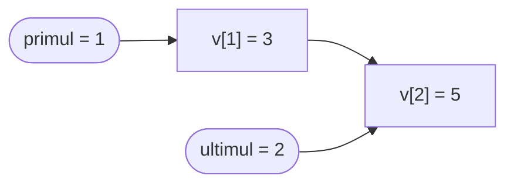
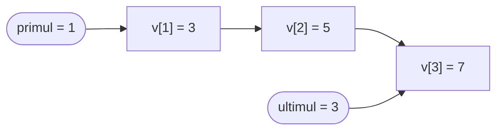
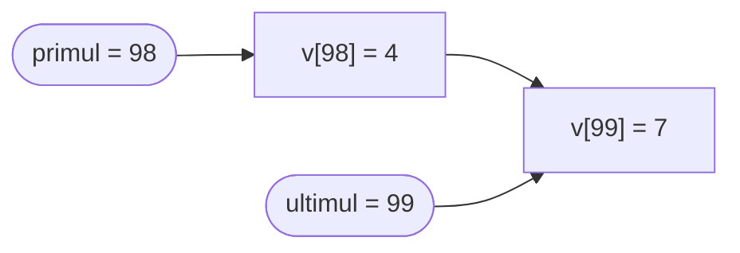

# Coada

O **coada** (in engleza *queue*) este o **structura de date abstracta**: nu este un tip predefinit al limbajului, ci un *mod de organizare* a datelor in care conteaza **ordinea** in care adaugam si scoatem elemente.

Regula cozii este una singura:

> **Primul element pus este primul care iese.**

Aceasta regula se numeste **FIFO** — *First In, First Out* (primul intrat, primul iesit).

---

## Coada in viata reala

Numele structurii vine chiar de la cozile in care stam zilnic. In toate exemplele de mai jos, cine ajunge primul este servit primul, iar cine ajunge mai tarziu se aseaza **la sfarsit**:

- **Coada la casa de marcat**: clientii nou veniti se aseaza la sfarsit, iar casierul il serveste pe cel din fata.
- **Coada la ghiseul de bilete**: la fel — nu ai voie sa "sari" peste cei care asteapta deja.
- **Masinile la bariera** unei parcari: prima masina sosita este prima care trece.
- **Documentele trimise la imprimanta**: se tiparesc in ordinea in care au fost trimise.
- **Apelurile la un call center**: apelantii sunt preluati in ordinea in care au sunat.
- **Lista de asteptare la o carte** de la biblioteca: primul inscris o primeste primul.

Toate au acelasi comportament: **adaugi la un capat (sfarsitul cozii) si scoti de la celalalt capat (inceputul cozii)**.

> [!NOTE] Observatie
> Aceasta este exact diferenta fata de [stiva](/cpp/algoritmi/clasa-a-10a/stiva): la stiva adaugi si scoti prin **acelasi** capat (varful), deci ultimul venit iese primul (LIFO). La coada, capatul prin care intri si capatul prin care iesi sunt **diferite**, deci ordinea de intrare se pastreaza (FIFO).

---

## Operatiile cu coada

O coada pune la dispozitie un set restrans de operatii. Le explicam pe exemplul cozii de la casa de marcat:

| Operatie | In limbaj de coada | La casa de marcat |
|----------|--------------------|-------------------|
| **push** | adauga un element la sfarsitul cozii | un client nou se aseaza la coada, in spate |
| **pop**  | scoate elementul din fata cozii | clientul din fata a fost servit si pleaca |
| **front**| citeste elementul din fata, fara sa-l scoata | te uiti cine este primul la rand |
| **coada vida** | verifici daca nu mai e niciun element | nu mai asteapta nimeni la casa |

Ce **nu** putem face: nu putem citi sau scoate un element din mijlocul cozii, asa cum nu poti servi pe cineva din mijlocul randului fara sa-i superi pe toti cei dinaintea lui.

> [!NOTE] Observatie
> In alte manuale sau in biblioteca standard vei intalni si alte denumiri pentru aceleasi operatii: `push` se mai numeste **enqueue** sau `push_back`, iar `pop` se mai numeste **dequeue** sau `pop_front`. Operatia `front` se mai numeste, la fel ca la stiva, "citirea capului cozii".

---

## Reprezentarea cu struct

La stiva ne-a fost suficienta o singura variabila (`varf`), pentru ca lucram la un singur capat. La coada avem **doua** capete, deci avem nevoie de **doua** variabile: una pentru inceput si una pentru sfarsit.

Ca sa nu tinem tabloul si cele doua variabile ca trei date separate (si ca sa putem avea usor **mai multe cozi** in acelasi program), le grupam intr-un [struct](/cpp/algoritmi/clasa-a-10a/struct):

```cpp
struct Coada
{
    int v[100];
    int primul, ultimul;
};
```

Conventia pe care o folosim:
- elementele utile stau pe pozitiile `v[primul]`, `v[primul + 1]`, ..., `v[ultimul]`;
- `v[primul]` este **inceputul** cozii (primul element intrat, urmatorul care va iesi);
- `v[ultimul]` este **sfarsitul** cozii (ultimul element adaugat);
- coada vida se recunoaste dupa `primul > ultimul`.

La inceput punem `primul = 1` si `ultimul = 0`. Astfel avem `primul > ultimul`, adica exact conditia de coada vida:

```cpp
Coada c;

c.primul = 1;
c.ultimul = 0;
```

> [!WARNING] Atentie
> Nu initializa `ultimul` cu `1`! Daca ai `primul = 1` si `ultimul = 1`, coada **nu** este vida: ar insemna ca `v[1]` este deja un element valid, desi nu am pus nimic in coada.

Dupa ce am adaugat valorile `3` si `5` (in aceasta ordine), coada arata asa:



Valoarea `3` a intrat prima, deci este in fata cozii si va iesi prima. Valoarea `5` a intrat a doua, deci este la sfarsit.

---

### push — adaugare la sfarsit

Pentru a pune un element nou `x` la sfarsitul cozii, crestem `ultimul` cu `1` (apare o pozitie noua in spate) si scriem acolo valoarea:

```cpp
c.ultimul++;
c.v[c.ultimul] = x;
```

**Inainte** (`primul = 1`, `ultimul = 2`) — adaugam valoarea `7`:


**Dupa** (`c.ultimul++` apoi `c.v[c.ultimul] = 7`):


Observa ca `primul` nu se modifica: fata cozii ramane neschimbata cand vine cineva nou la rand.

---

### pop — scoatere din fata

Pentru a scoate elementul din fata este suficient sa **crestem** `primul` cu `1`. Valoarea ramane in tablou, dar nu o mai consideram parte din coada:

```cpp
c.primul++;
```

**Inainte** (`primul = 1`, `ultimul = 3`):



**Dupa** (`c.primul++`, valoarea `3` a iesit din coada):


> [!IMPORTANT] Important
> La stiva, `pop` **scadea** `varf`. La coada, `pop` **creste** `primul`. Ambele variabile, `primul` si `ultimul`, se deplaseaza doar spre dreapta — coada "se plimba" prin tablou.

---

### front — citirea inceputului cozii

Inceputul cozii este pur si simplu `c.v[c.primul]`. Il citim fara sa modificam nimic:

```cpp
cout << c.v[c.primul];
```

### coada vida

Coada este goala cand `primul` a depasit `ultimul`:

```cpp
if (c.primul > c.ultimul)
    cout << "Coada este vida";
```

### numarul de elemente

Elementele ocupa pozitiile de la `primul` la `ultimul`, deci numarul lor este:

```cpp
cout << c.ultimul - c.primul + 1;
```

> [!WARNING] Atentie
> Nu scoate niciodata dintr-o coada vida! Inainte de un `pop` sau de a citi `front`, verifica intotdeauna ca `primul <= ultimul`. Altfel citesti o pozitie care nu contine un element valid.

---

## Operatiile ca functii

Pentru ca in probleme apar aceleasi patru operatii de fiecare data, le scriem o singura data, ca **functii**. Functiile primesc un **pointer** la coada (`Coada *c`) pentru a putea modifica coada primita, si folosesc [operatorul sageata](/cpp/algoritmi/clasa-a-10a/struct) `->`:

```cpp
struct Coada
{
    int v[100];
    int primul, ultimul;
};

void initializeaza(Coada *c)
{
    c->primul = 1;
    c->ultimul = 0;
}

int esteVida(Coada *c)
{
    return c->primul > c->ultimul;
}

void push(Coada *c, int x)
{
    c->ultimul++;
    c->v[c->ultimul] = x;
}

int front(Coada *c)
{
    return c->v[c->primul];
}

void pop(Coada *c)
{
    c->primul++;
}
```

Folosirea lor arata asa:

```cpp
Coada c;

initializeaza(&c);
push(&c, 3);
push(&c, 5);
cout << front(&c);   // afiseaza 3
pop(&c);
cout << front(&c);   // afiseaza 5
```

> [!TIP] Sfat
> Toate cele patru functii au **doua-trei linii**. Avantajul lor nu este ca scurteaza codul, ci ca dau **nume** operatiilor: cand citesti `push(&c, x)` intelegi imediat intentia, pe cand `c.ultimul++; c.v[c.ultimul] = x;` trebuie descifrat de fiecare data.

> [!NOTE] Observatie
> Trimitem `&c` (adresa cozii), nu `c`. Daca am trimite coada prin valoare, functia ar primi o **copie** a ei si modificarile facute in functie nu s-ar mai vedea in `main`.

---

## Probleme rezolvate

In toate problemele urmatoare folosim acelasi struct `Coada` si aceleasi patru functii definite mai sus.

### Problema 1: Coada la ghiseu

**Enunt:** Se citesc comenzi, pana la intalnirea comenzii `0`:
- `1 x` — clientul cu numarul `x` se aseaza la coada;
- `2` — este servit clientul din fata cozii (daca exista).

Sa se afiseze, in ordine, numerele clientilor serviti, iar la final cati clienti au ramas la coada.

**Idee:** Comanda `1` este un `push`, comanda `2` este un `front` (ca sa aflam pe cine servim) urmat de un `pop`. Numarul celor ramasi este `ultimul - primul + 1`.

```cpp
#include <iostream>
using namespace std;

struct Coada
{
    int v[100];
    int primul, ultimul;
};

void initializeaza(Coada *c)
{
    c->primul = 1;
    c->ultimul = 0;
}

int esteVida(Coada *c)
{
    return c->primul > c->ultimul;
}

void push(Coada *c, int x)
{
    c->ultimul++;
    c->v[c->ultimul] = x;
}

int front(Coada *c)
{
    return c->v[c->primul];
}

void pop(Coada *c)
{
    c->primul++;
}

Coada c;
int comanda, x;

int main()
{
    initializeaza(&c);

    cin >> comanda;
    while (comanda != 0)
    {
        if (comanda == 1)
        {
            cin >> x;
            push(&c, x);
        }
        else
        {
            if (esteVida(&c) == 0)
            {
                cout << front(&c) << " ";
                pop(&c);
            }
        }
        cin >> comanda;
    }
    cout << endl;

    cout << "Au ramas " << c.ultimul - c.primul + 1 << " clienti" << endl;
    return 0;
}
```

**Intrare:**
```
1 7 1 3 2 1 5 2 0
```

**Afisare:**
```
7 3
Au ramas 1 clienti
```

> [!NOTE] Observatie
> Clientul `7` a venit primul, deci a fost servit primul, desi comanda `2` a aparut dupa ce se asezasera deja doi clienti. La final in coada mai este doar clientul `5`: `primul = 3`, `ultimul = 3`, deci `3 - 3 + 1 = 1` client.

---

### Problema 2: Distribuirea pe doua cozi

**Enunt:** Se citeste `n`, apoi `n` numere intregi. Sa se afiseze intai numerele pare, apoi cele impare, fiecare grup pastrand ordinea in care numerele au fost citite.

**Idee:** Folosim **doua** cozi: `cPare` si `cImpare`. Fiecare numar citit este pus la sfarsitul cozii potrivite. La final golim coada numerelor pare, apoi coada numerelor impare. Pentru ca o coada pastreaza ordinea de intrare, ordinea din enunt este respectata automat.

Aici se vede castigul struct-ului: doua cozi inseamna **doua variabile** de tip `Coada`, nu doi vectori si patru variabile intregi separate.

```cpp
#include <iostream>
using namespace std;

struct Coada
{
    int v[100];
    int primul, ultimul;
};

void initializeaza(Coada *c)
{
    c->primul = 1;
    c->ultimul = 0;
}

int esteVida(Coada *c)
{
    return c->primul > c->ultimul;
}

void push(Coada *c, int x)
{
    c->ultimul++;
    c->v[c->ultimul] = x;
}

int front(Coada *c)
{
    return c->v[c->primul];
}

void pop(Coada *c)
{
    c->primul++;
}

Coada cPare, cImpare;
int n, i, x;

int main()
{
    initializeaza(&cPare);
    initializeaza(&cImpare);

    cin >> n;
    for (i = 1; i <= n; i++)
    {
        cin >> x;
        if (x % 2 == 0)
            push(&cPare, x);
        else
            push(&cImpare, x);
    }

    while (esteVida(&cPare) == 0)
    {
        cout << front(&cPare) << " ";
        pop(&cPare);
    }

    while (esteVida(&cImpare) == 0)
    {
        cout << front(&cImpare) << " ";
        pop(&cImpare);
    }
    cout << endl;
    return 0;
}
```

**Intrare:**
```
7
4 9 2 7 6 1 8
```

**Afisare:**
```
4 2 6 8 9 7 1
```

> [!TIP] Sfat
> Daca aceeasi problema s-ar rezolva cu doua **stive**, fiecare grup ar iesi in ordine inversa (`8 6 2 4`). Alegerea structurii de date decide, singura, ordinea rezultatului.

---

### Problema 3: Numaratoarea copiilor

**Enunt:** `n` copii, numerotati de la `1` la `n`, stau in cerc. Se numara din `k` in `k`, iar al `k`-lea copil numarat iese din joc; numaratoarea continua de la urmatorul. Sa se afiseze ordinea in care ies copiii si cine ramane ultimul.

**Idee:** Cercul de copii este chiar o coada, cu o singura diferenta: cine este numarat, dar **nu** iese, se intoarce la sfarsitul cozii (adica in urma tuturor, exact ca in cerc). Deci:
- de `k - 1` ori: scoatem copilul din fata si il punem inapoi la sfarsit;
- al `k`-lea: il scoatem din fata si nu il mai punem inapoi — el iese din joc.

Repetam pana cand coada se goleste. Ultimul copil afisat este cel care a ramas.

```cpp
#include <iostream>
using namespace std;

struct Coada
{
    int v[100];
    int primul, ultimul;
};

void initializeaza(Coada *c)
{
    c->primul = 1;
    c->ultimul = 0;
}

int esteVida(Coada *c)
{
    return c->primul > c->ultimul;
}

void push(Coada *c, int x)
{
    c->ultimul++;
    c->v[c->ultimul] = x;
}

int front(Coada *c)
{
    return c->v[c->primul];
}

void pop(Coada *c)
{
    c->primul++;
}

Coada c;
int n, k, i, x;

int main()
{
    cin >> n >> k;

    initializeaza(&c);
    for (i = 1; i <= n; i++)
        push(&c, i);

    while (esteVida(&c) == 0)
    {
        // primii k - 1 copii sunt numarati si trec la sfarsitul cercului
        for (i = 1; i <= k - 1; i++)
        {
            x = front(&c);
            pop(&c);
            push(&c, x);
        }

        // al k-lea copil iese din joc
        x = front(&c);
        pop(&c);
        cout << x << " ";
    }
    cout << endl;
    return 0;
}
```

**Intrare:**
```
7 3
```

**Afisare:**
```
3 6 2 7 5 1 4
```

> [!NOTE] Observatie
> Ies, in ordine, copiii `3`, `6`, `2`, `7`, `5`, `1`, iar ultimul ramas este copilul `4`. Cele trei instructiuni `x = front(&c); pop(&c); push(&c, x);` inseamna "trece la sfarsitul cozii" — mutarea care transforma un sir intr-un cerc.

> [!WARNING] Atentie
> Aici fiecare copil este pus in coada de mai multe ori, deci `ultimul` creste mult peste `n`. Pentru `n = 7` si `k = 3` se fac in total 21 de operatii `push`, ceea ce incape in `v[100]`, dar pentru valori mai mari ale lui `n` si `k` tabloul se termina. Solutia este **coada circulara**, prezentata mai jos.

---

### Problema 4: Numerele formate doar din cifrele 1 si 2

**Enunt:** Se citeste `n`. Sa se afiseze, in ordine crescatoare, primele `n` numere naturale formate doar din cifrele `1` si `2`.

**Idee:** Cel mai mic astfel de numar este `1`, urmat de `2`. Orice alt numar se obtine dintr-unul deja gasit, lipindu-i la dreapta cifra `1` sau cifra `2` (adica `10 * x + 1`, respectiv `10 * x + 2`).

Punem in coada valorile `1` si `2`. Apoi, cat timp mai avem nevoie de numere: scoatem numarul din fata, il afisam si adaugam la sfarsitul cozii cele doua numere obtinute din el. Pentru ca un numar generat este mereu mai mare decat cel din care provine, iar coada respecta ordinea de intrare, numerele ies **automat in ordine crescatoare** — nu trebuie sa sortam nimic.

```cpp
#include <iostream>
using namespace std;

struct Coada
{
    int v[100];
    int primul, ultimul;
};

void initializeaza(Coada *c)
{
    c->primul = 1;
    c->ultimul = 0;
}

int esteVida(Coada *c)
{
    return c->primul > c->ultimul;
}

void push(Coada *c, int x)
{
    c->ultimul++;
    c->v[c->ultimul] = x;
}

int front(Coada *c)
{
    return c->v[c->primul];
}

void pop(Coada *c)
{
    c->primul++;
}

Coada c;
int n, i, x;

int main()
{
    cin >> n;

    initializeaza(&c);
    push(&c, 1);
    push(&c, 2);

    for (i = 1; i <= n; i++)
    {
        x = front(&c);
        pop(&c);
        cout << x << " ";

        push(&c, 10 * x + 1);
        push(&c, 10 * x + 2);
    }
    cout << endl;
    return 0;
}
```

**Intrare:**
```
8
```

**Afisare:**
```
1 2 11 12 21 22 111 112
```

> [!TIP] Sfat
> Acesta este primul exemplu in care coada nu memoreaza date citite, ci **rezultate partiale care urmeaza sa fie prelucrate**. Este chiar ideea din spatele parcurgerii in latime (algoritmul lui Lee): scoti o stare din coada, o prelucrezi si adaugi la sfarsit starile obtinute din ea.

> [!WARNING] Atentie
> La fiecare pas scoatem un element si adaugam doua, deci coada creste cu un element pe pas. Cu `v[100]`, programul functioneaza corect doar pentru valori mici ale lui `n` (sub 50). In plus, numerele generate cresc foarte repede si depasesc tipul `int` dupa aproximativ 9 cifre.

---

## Capacitatea cozii: coada circulara

> [!IMPORTANT] Pentru cei avansati
> Sectiunea urmatoare rezolva o limitare a implementarii de mai sus. Citeste-o dupa ce stapanesti bine cele patru operatii de baza.

Am vazut ca `primul` si `ultimul` cresc mereu, deci coada **se deplaseaza spre dreapta** prin tablou. Dupa multe operatii ajungem in situatia absurda in care coada contine 2 elemente, dar nu mai putem adauga nimic pentru ca `ultimul` a ajuns la capatul tabloului:



Pozitiile de la `1` la `97` sunt libere, dar noi nu le mai folosim niciodata.

**Solutia:** consideram tabloul **circular** — dupa ultima pozitie urmeaza din nou prima. In loc sa scriem `ultimul++`, calculam pozitia urmatoare cu operatorul `%`:

```cpp
const int N = 99;   // pozitiile utile sunt 1, 2, ..., N

// pozitia de dupa p, in tabloul circular
p = p % N + 1;
```

Formula duce `1` in `2`, `2` in `3`, ..., `98` in `99`, iar `99` inapoi in `1` — exact ce ne trebuie.

Apare insa o problema noua: cu tabloul circular, conditia `primul > ultimul` nu mai inseamna "coada vida", pentru ca `ultimul` poate ajunge, dupa o rotire, in fata lui `primul`. De aceea adaugam in struct un al treilea camp, `nrElemente`, care numara cate elemente sunt efectiv in coada:

```cpp
const int N = 99;

struct Coada
{
    int v[100];
    int primul, ultimul, nrElemente;
};

void initializeaza(Coada *c)
{
    c->primul = 1;
    c->ultimul = 0;
    c->nrElemente = 0;
}

int esteVida(Coada *c)
{
    return c->nrElemente == 0;
}

void push(Coada *c, int x)
{
    c->ultimul = c->ultimul % N + 1;
    c->v[c->ultimul] = x;
    c->nrElemente++;
}

int front(Coada *c)
{
    return c->v[c->primul];
}

void pop(Coada *c)
{
    c->primul = c->primul % N + 1;
    c->nrElemente--;
}
```

Restul programelor ramane **neschimbat**: in problemele de mai sus am folosit doar `initializeaza`, `esteVida`, `push`, `front` si `pop`, deci este suficient sa inlocuim aceste cinci functii ca sa mearga si pentru numere mult mai mari de operatii.

> [!TIP] Sfat
> Acesta este marele avantaj al faptului ca am ascuns detaliile in functii: am schimbat complet modul in care coada foloseste tabloul, fara sa modificam nicio linie din `main`.

> [!NOTE] Observatie
> Cu varianta circulara, coada nu se mai "termina" degeaba, dar tot are o capacitate maxima: nu poate contine mai mult de `N` elemente in acelasi timp. Inainte de `push` se poate verifica `nrElemente < N`.
