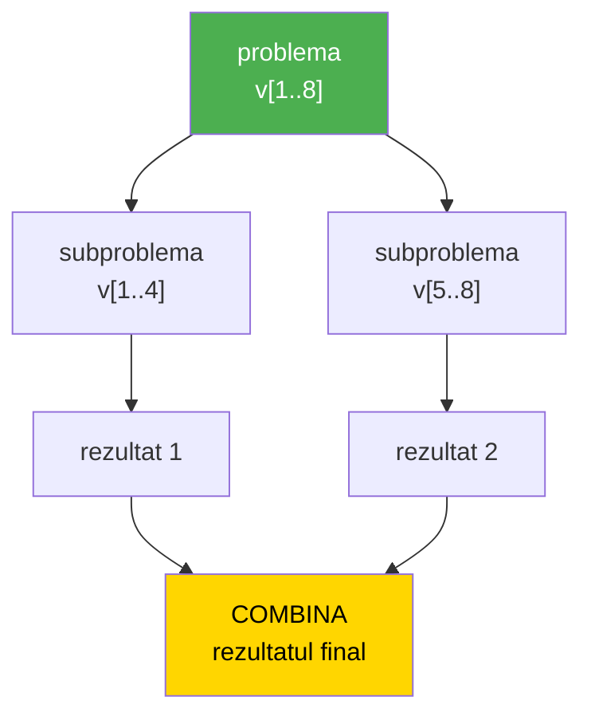
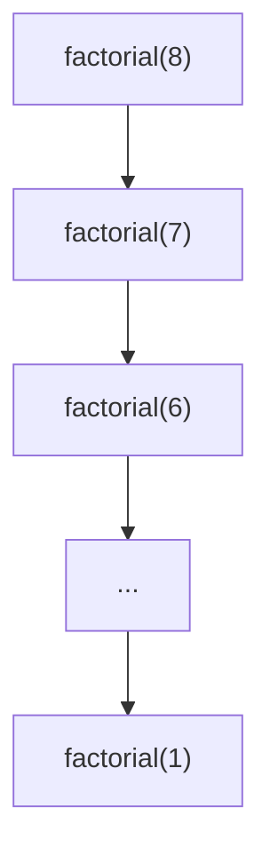
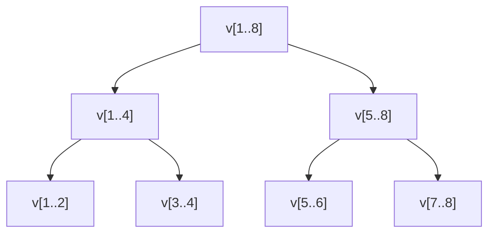
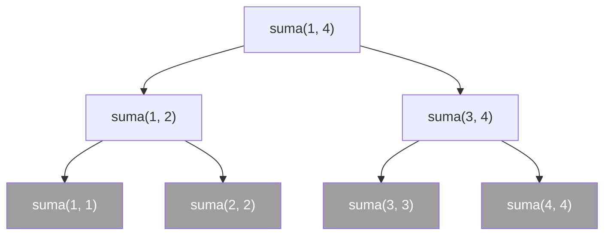
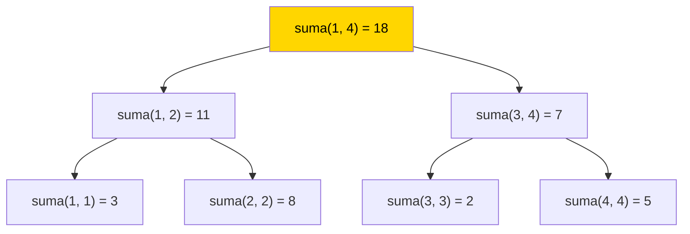
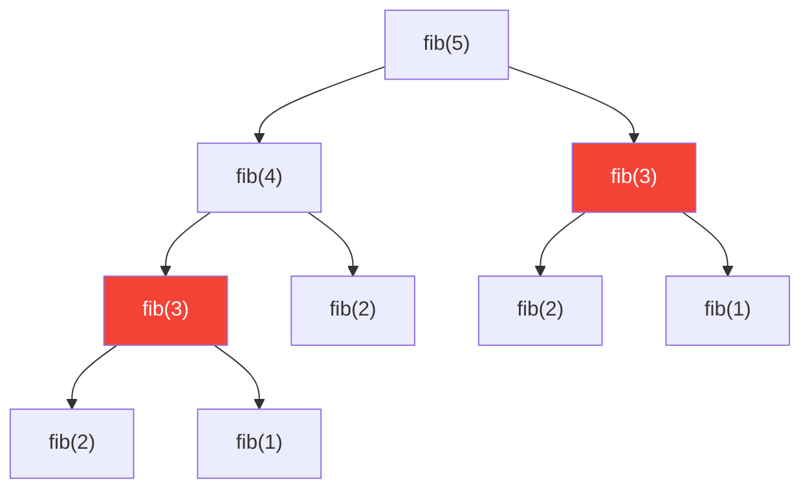

# Divide et Impera

**Divide et Impera** este metoda prin care impartim o problema in mai multe probleme **mai mici** si **independente**, de acelasi tip cu problema initiala.

Numele vine din latina si inseamna "imparte si stapaneste".

Sunt trei lucruri in definitie care conteaza, si fiecare trebuie luat in serios:

- **mai mici** — subproblemele trebuie sa fie strict mai mici decat problema din care au iesit, altfel nu ne apropiem niciodata de un raspuns;
- **independente** — subproblemele nu au nimic in comun. Nu se ajuta una pe alta, nu impart date, nu se asteapta una pe alta. Fiecare se rezolva complet, fara sa stie ca cealalta exista;
- **de acelasi tip** — subproblema arata exact ca problema mare, doar ca e mai mica. De aceea o pot rezolva cu **aceeasi** functie, adica recursiv.

---

## Cele trei etape

Numele metodei aminteste doar doua etape, dar in realitate sunt trei:

1. **Divide** — impart problema in doua (sau mai multe) subprobleme mai mici si independente.
2. **Stapaneste** — rezolv fiecare subproblema. Daca este destul de mica, ii dau raspunsul direct; daca nu, aplic din nou aceeasi metoda, deci fac un **apel recursiv**.
3. **Combina** — asamblez rezultatele subproblemelor in rezultatul problemei mari.



> [!IMPORTANT] Important
> Etapa de **combinare** este cea care se schimba de la o problema la alta. Impartirea in doua jumatati arata aproape mereu la fel; ce difera este ce faci cu cele doua rezultate dupa ce le-ai obtinut.

---

## Nu orice recursie este divide et impera

Aceasta este cea mai deasa confuzie. In lectia de [recursie](./recursie) am scris functii recursive care **nu** sunt divide et impera.

Priveste `factorial`:

```cpp
int factorial(int n)
{
    if (n <= 1) return 1;
    return n * factorial(n - 1);
}
```

Problema `factorial(n)` se reduce la **o singura** subproblema, `factorial(n - 1)`, mai mica doar cu 1. Apelurile formeaza un **lant**:



La divide et impera problema se rupe in **doua** subprobleme, fiecare de dimensiune **jumatate**. Apelurile formeaza un **arbore**:



|  | Recursie liniara (`factorial`) | Divide et Impera |
|---|---|---|
| Cate subprobleme | una singura | doua (sau mai multe) |
| Cat de mica e subproblema | cu 1 mai mica | jumatate |
| Forma apelurilor | lant | arbore |
| Adancimea stivei | `n` | `log2(n)` |

> [!NOTE] Observatie
> Divide et impera se **scrie** intotdeauna recursiv, dar nu orice functie recursiva este divide et impera. Recursia este unealta; divide et impera este metoda.

---

## Sablonul general

Aproape toate problemele de divide et impera pe vectori arata la fel. Lucram pe secventa `v[st..dr]`, iar `st` si `dr` sunt parametrii functiei:

```cpp
tipRezultat rezolva(int st, int dr)
{
    if (st == dr)                             // cazul de baza: un singur element
        return raspunsul pentru v[st];

    int mij, rezStanga, rezDreapta;

    mij = (st + dr) / 2;                      // DIVIDE
    rezStanga = rezolva(st, mij);             // STAPANESTE prima jumatate
    rezDreapta = rezolva(mij + 1, dr);        // STAPANESTE a doua jumatate

    return combinare(rezStanga, rezDreapta);  // COMBINA
}
```

Apelul din `main` este `rezolva(1, n)` — adica "rezolva pentru tot vectorul".

Doua lucruri de observat in sablon:

**Cazul de baza este `st == dr`.** Inseamna ca secventa are un singur element, iar raspunsul il stim direct, fara niciun calcul. Ca la orice functie recursiva, cazul de baza se scrie **primul** si **opreste** executia.

**Cele doua jumatati sunt `[st, mij]` si `[mij + 1, dr]`.** Elementul `v[mij]` intra in jumatatea din stanga, iar cea din dreapta incepe de la `mij + 1`. Asa cele doua secvente **nu au niciun element comun** — sunt independente, exact cum cere definitia.

> [!WARNING] Atentie
> Daca scrii `rezolva(mij, dr)` in loc de `rezolva(mij + 1, dr)`, elementul `v[mij]` ajunge in **amandoua** jumatatile. Subproblemele nu mai sunt independente, iar programul intra in **recursie infinita**. Revenim la aceasta greseala in sectiunea [Capcane frecvente](#capcane-frecvente).

---

## Exemplu — suma elementelor unui vector

Suma elementelor din `v[st..dr]` este suma din prima jumatate plus suma din a doua jumatate:

```
s(st, dr) = s(st, mij) + s(mij + 1, dr)     (cazul general)
s(st, st) = v[st]                           (cazul de baza)
```

Cazul de baza este limpede: suma unei secvente cu un singur element este chiar acel element.

```cpp
#include <iostream>
using namespace std;

int n, i, v[101];

int suma(int st, int dr)
{
    if (st == dr)
        return v[st];

    int mij, sumaStanga, sumaDreapta;

    mij = (st + dr) / 2;
    sumaStanga = suma(st, mij);
    sumaDreapta = suma(mij + 1, dr);

    return sumaStanga + sumaDreapta;
}
int main()
{
    cin >> n;
    for (i = 1; i <= n; i++)
    {
        cin >> v[i];
    }

    cout << suma(1, n);
    return 0;
}
```

**Intrare:**
```
4
3 8 2 5
```

**Afisare:**
```
18
```

### Arborele apelurilor

Pentru vectorul `3 8 2 5`, apelul initial este `suma(1, 4)`. La **coborare** fiecare apel se rupe in doua:



Nodurile gri sunt cazurile de baza — acolo `st` este egal cu `dr`, deci recursia se opreste. Observa ca **frunzele arborelui sunt exact elementele vectorului**, fiecare o singura data: `v[1]`, `v[2]`, `v[3]`, `v[4]`. Asta e independenta, vazuta pe desen: nicio secventa nu apare de doua ori.

La **urcare**, fiecare apel isi primeste cele doua rezultate si le aduna:



`suma(1, 2)` intoarce `3 + 8 = 11`, `suma(3, 4)` intoarce `2 + 5 = 7`, iar apelul de sus le combina: `11 + 7 = 18`.

### Sa vedem executia pas cu pas

Ruleaza programul si urmareste panoul stivei. Este acelasi program de mai sus, cu vectorul `3 8 2 5`.

<DebuggerVisual trace="suma-divide-impera" :heap="false" titlu="suma(1, 4) — arborele are 7 apeluri, dar pe stiva sunt cel mult 3 deodata" />

> [!TIP] Sfat
> Arborele si stiva arata lucruri **diferite**, si merita sa le compari:
> - **arborele** arata **toate** apelurile facute, de la inceput pana la sfarsit — sunt 7;
> - **stiva** arata doar apelurile **in curs**, cele care inca asteapta un rezultat — nu sunt niciodata mai mult de 3 deodata.
>
> Un apel care si-a terminat treaba dispare de pe stiva, dar ramane in arbore.

> [!NOTE] Observatie
> Pe acest exemplu divide et impera **nu** este mai rapid decat un `for` obisnuit: si asa, si asa se aduna `n` numere. Il folosim pentru ca se vede sablonul curat, cu toate cele trei etape la locul lor. Castigul de viteza apare la alte probleme — vezi [ridicarea rapida la putere](#exemplu-—-ridicarea-rapida-la-putere).

Aceasta este [problema SumVec de pe pbinfo](https://www.pbinfo.ro/probleme/1015/sumvec).

---

## Exemplu — maximul dintr-un vector

Maximul din `v[st..dr]` este cel mai mare dintre maximul primei jumatati si maximul celei de-a doua:

```
m(st, dr) = maximul dintre m(st, mij) si m(mij + 1, dr)     (cazul general)
m(st, st) = v[st]                                           (cazul de baza)
```

```cpp
#include <iostream>
using namespace std;

int n, i, v[101];

int maxim(int st, int dr)
{
    if (st == dr)
        return v[st];

    int mij, maxStanga, maxDreapta;

    mij = (st + dr) / 2;
    maxStanga = maxim(st, mij);
    maxDreapta = maxim(mij + 1, dr);

    if (maxStanga > maxDreapta)
        return maxStanga;
    return maxDreapta;
}
int main()
{
    cin >> n;
    for (i = 1; i <= n; i++)
    {
        cin >> v[i];
    }

    cout << maxim(1, n);
    return 0;
}
```

**Intrare:**
```
6
4 17 2 9 17 3
```

**Afisare:**
```
17
```

Compara aceasta functie cu `suma`: sunt **identice**, cu exceptia etapei de combinare. Acolo adunam cele doua rezultate, aici il alegem pe cel mai mare.

> [!TIP] Sfat
> Cand ai de scris o problema de divide et impera pe un vector, nu incerca sa "vezi" toate apelurile in minte. Raspunde doar la doua intrebari:
> 1. **Ce raspund pentru o secventa cu un singur element?** (cazul de baza)
> 2. **Daca cineva imi da raspunsul pentru prima jumatate si raspunsul pentru a doua jumatate, cum obtin raspunsul pentru tot?** (combinarea)
>
> Restul sablonului se copiaza ca atare.

---

## Exemplu — cate elemente sunt egale cu o valoare data

Se citeste un vector si o valoare `x`. Cate elemente ale vectorului sunt egale cu `x`?

```
c(st, dr) = c(st, mij) + c(mij + 1, dr)     (cazul general)
c(st, st) = 1, daca v[st] este egal cu x
c(st, st) = 0, altfel                       (cazul de baza)
```

Aici cazul de baza nu mai intoarce elementul, ci un **numar de aparitii**: o secventa cu un singur element contine ori zero, ori o aparitie a lui `x`.

```cpp
#include <iostream>
using namespace std;

int n, x, i, v[101];

int cateEgale(int st, int dr)
{
    if (st == dr)
    {
        if (v[st] == x)
            return 1;
        return 0;
    }

    int mij, cateStanga, cateDreapta;

    mij = (st + dr) / 2;
    cateStanga = cateEgale(st, mij);
    cateDreapta = cateEgale(mij + 1, dr);

    return cateStanga + cateDreapta;
}
int main()
{
    cin >> n;
    for (i = 1; i <= n; i++)
    {
        cin >> v[i];
    }
    cin >> x;

    cout << cateEgale(1, n);
    return 0;
}
```

**Intrare:**
```
7
5 2 5 8 5 1 2
5
```

**Afisare:**
```
3
```

> [!NOTE] Observatie
> Corectitudinea vine tot din independenta: fiecare element al vectorului ajunge intr-**o singura** frunza a arborelui, deci este numarat exact o data. Daca jumatatile s-ar suprapune, unele elemente ar fi numarate de doua ori.

---

## Exemplu — ridicarea rapida la putere

Pana acum divide et impera ne-a dat cod elegant, dar nu si viteza. Aici se schimba treaba.

Vrem sa calculam `a` la puterea `n`. Varianta cunoscuta face `n - 1` inmultiri, una pentru fiecare factor in plus. Divide et impera face altfel: **injumatateste exponentul**.

Daca `n` este par, atunci `a` la puterea `n` este patratul lui `a` la puterea `n / 2`:

```
a^8 = a^4 * a^4
```

Daca `n` este impar, mai ramane un `a` in plus:

```
a^7 = a^3 * a^3 * a
```

Relatiile de recurenta sunt:

```
p(a, n) = p(a, n / 2) * p(a, n / 2),         daca n este par
p(a, n) = p(a, n / 2) * p(a, n / 2) * a,     daca n este impar
p(a, 0) = 1                                  (cazul de baza)
```

```cpp
#include <iostream>
using namespace std;

int baza, exponent;

int putere(int a, int n)
{
    if (n == 0)
        return 1;

    int p;

    p = putere(a, n / 2);

    if (n % 2 == 0)
        return p * p;
    return p * p * a;
}
int main()
{
    cin >> baza >> exponent;
    cout << putere(baza, exponent);
    return 0;
}
```

**Intrare:**
```
3 13
```

**Afisare:**
```
1594323
```

Derularea pentru `putere(3, 13)`, de la cazul de baza in sus:

| Apelul | `p` primit de la apelul de deasupra | `n` este par? | Rezultat intors |
|---|---|---|---|
| `putere(3, 0)` | — | — | `1` |
| `putere(3, 1)` | `1` | impar | `1 * 1 * 3 = 3` |
| `putere(3, 3)` | `3` | impar | `3 * 3 * 3 = 27` |
| `putere(3, 6)` | `27` | par | `27 * 27 = 729` |
| `putere(3, 13)` | `729` | impar | `729 * 729 * 3 = 1594323` |

Cinci apeluri, in loc de douasprezece inmultiri.

> [!IMPORTANT] Important
> Observa ca `putere` calculeaza `p` **o singura data** si il foloseste de doua ori. Cele doua subprobleme sunt aici **identice**, deci e destul sa o rezolvi pe una. Daca ai scrie:
>
> ```cpp
> return putere(a, n / 2) * putere(a, n / 2);   // gresit ca eficienta
> ```
>
> functia ar da acelasi rezultat corect, dar ar face aceeasi munca de doua ori la fiecare nivel — si tot castigul de viteza ar disparea.

> [!WARNING] Atentie
> Puterile cresc foarte repede si depasesc `int` inca de la valori mici (`2` la puterea `31` deja nu mai incape). La problemele de concurs se cere de obicei rezultatul modulo un numar, tocmai din acest motiv. Pentru valori ceva mai mari se poate folosi `long long`.

---

## De ce conteaza injumatatirea

Cand micsorezi problema cu 1, ai nevoie de `n` pasi ca sa ajungi la 1. Cand o **injumatatesti**, ai nevoie de mult mai putini:

| `n` | De cate ori injumatatesc pana ajung la 1 |
|---|---|
| `8` | `3` |
| `1.024` | `10` |
| `1.000.000` | `20` |
| `1.000.000.000` | `30` |

Numarul acesta se numeste `log2(n)` — de cate ori pot imparti pe `n` la 2 pana ajung la 1. Creste ametitor de incet: de la un milion la un miliard, `n` se inmulteste cu 1000, dar numarul de injumatatiri creste doar de la 20 la 30.

De aici se vad si limitele metodei. Sunt doua situatii diferite:

- **Cobor pe amandoua ramurile** (suma, maximul, numararea). Arborele are `n` frunze, deci in total se fac cam `2 * n` apeluri — tot atatea operatii cate face si un `for`. Castig doar la **adancimea stivei**, care este `log2(n)` in loc de `n`.
- **Cobor pe o singura ramura** (ridicarea la putere). Atunci nu mai parcurg un arbore, ci un lant de lungime `log2(n)` — si aici castigul este urias: 30 de pasi in loc de un miliard.

> [!NOTE] Observatie
> Exista si un al treilea caz, cel mai interesant: cobor pe amandoua ramurile, dar **combinarea** face o treaba serioasa. Asa functioneaza sortarea prin interclasare, pe care o vei studia separat.

---

## Cand NU merge divide et impera

Definitia cere ca subproblemele sa fie **independente**. Cand aceasta conditie nu este indeplinita, metoda nu se aplica — chiar daca problema *pare* ca se imparte in doua.

Exemplul clasic este sirul lui Fibonacci, din lectia de [recursie](./recursie#exemplu-—-sirul-lui-fibonacci):

```cpp
int fibonacci(int n)
{
    if (n <= 2) return 1;
    return fibonacci(n - 1) + fibonacci(n - 2);
}
```

La prima vedere seamana cu divide et impera: doua apeluri recursive, iar rezultatele se combina prin adunare. Dar cele doua subprobleme **nu sunt independente**: ca sa calculezi `fib(n - 1)` ai nevoie, printre altele, chiar de `fib(n - 2)`. Subproblemele **se suprapun**.



`fib(3)` este calculat de **doua** ori (nodurile rosii), iar `fib(2)` de **trei** ori. Compara acest desen cu arborele lui `suma`, unde fiecare secventa apare exact o data.

> [!IMPORTANT] Important
> Retine deosebirea:
> - **subprobleme disjuncte** (`v[1..4]` si `v[5..8]` nu au niciun element comun) → este divide et impera, fiecare bucata se rezolva o singura data;
> - **subprobleme care se suprapun** (`fib(n - 1)` si `fib(n - 2)`) → nu este divide et impera, acelasi calcul se repeta de nenumarate ori.
>
> Pentru al doilea caz exista o alta metoda, numita **programare dinamica**, in care rezultatele deja calculate se retin ca sa nu mai fie calculate a doua oara.

---

## Capcane frecvente

### 1. Cele doua jumatati se suprapun

```cpp
mij = (st + dr) / 2;
sumaStanga = suma(st, mij);
sumaDreapta = suma(mij, dr);   // gresit: mij apare in ambele jumatati
```

Aceasta este **cea mai frecventa** greseala. Sa vedem ce se intampla pentru `suma(1, 2)`: `mij` este `1`, deci al doilea apel devine `suma(1, 2)` — exact apelul in care ne aflam. Functia se reapeleaza cu aceleasi valori, la nesfarsit: **stack overflow**.

Corect este `suma(mij + 1, dr)`, ca `v[mij]` sa apartina unei singure jumatati.

### 2. Cazul de baza lipseste sau nu opreste executia

```cpp
int suma(int st, int dr)
{
    int mij, sumaStanga, sumaDreapta;

    mij = (st + dr) / 2;               // nu exista nicio conditie de oprire
    sumaStanga = suma(st, mij);
    sumaDreapta = suma(mij + 1, dr);

    return sumaStanga + sumaDreapta;
}
```

Este aceeasi greseala ca la orice functie recursiva (vezi [Capcane frecvente](./recursie#capcane-frecvente) din lectia de recursie). Cazul de baza `st == dr` se scrie **primul** si trebuie sa iasa din functie cu `return`.

### 3. Aceeasi subproblema, rezolvata de doua ori

```cpp
return putere(a, n / 2) * putere(a, n / 2);
```

Rezultatul este corect, dar munca se dubleaza la fiecare nivel. Cand cele doua subprobleme sunt identice, rezolva **una singura** si retine rezultatul intr-o variabila.

### 4. Uiti conditia de la "cusatura"

Nu orice problema se rezolva doar din cele doua rezultate. Uneori mai trebuie verificat si ce se intampla **la granita** dintre jumatati, adica intre `v[mij]` si `v[mij + 1]`. Urmatoarea sectiune arata exact un asemenea caz.

---

## Probleme rezolvate de pe pbinfo

### Suma elementelor pare

Enuntul complet este la [problema SumPareVec](https://www.pbinfo.ro/probleme/1017/sumparevec). Pe scurt: se citesc `n` si apoi `n` numere naturale. Folosind metoda divide et impera, sa se determine **suma elementelor pare** din sir.

Fata de exemplul cu suma tuturor elementelor se schimba un singur lucru: **cazul de baza**. Un element intra in suma doar daca este par.

```
sp(st, dr) = sp(st, mij) + sp(mij + 1, dr)     (cazul general)
sp(st, st) = v[st], daca v[st] este par
sp(st, st) = 0, altfel                         (cazul de baza)
```

```cpp
#include <iostream>
using namespace std;

int n, i, v[101];

int sumaPare(int st, int dr)
{
    if (st == dr)
    {
        if (v[st] % 2 == 0)
            return v[st];
        return 0;
    }

    int mij, sumaStanga, sumaDreapta;

    mij = (st + dr) / 2;
    sumaStanga = sumaPare(st, mij);
    sumaDreapta = sumaPare(mij + 1, dr);

    return sumaStanga + sumaDreapta;
}
int main()
{
    cin >> n;
    for (i = 1; i <= n; i++)
    {
        cin >> v[i];
    }

    cout << sumaPare(1, n);
    return 0;
}
```

**Intrare:**
```
6
3 8 2 5 10 7
```

**Afisare:**
```
20
```

> [!TIP] Sfat
> Ai putea fi tentat sa nu mai cobori deloc in jumatatile care nu contin numere pare. Nu se poate: ca sa stii daca o secventa contine numere pare, trebuie oricum sa te uiti la toate elementele ei. Selectia se face in **cazul de baza**, acolo unde ai in fata un singur element si poti decide.

### Verificarea unui vector ordonat crescator

Enuntul complet este la [problema VerificareOrdonatDivImp](https://www.pbinfo.ro/probleme/1152/verificareordonatdivimp). Pe scurt: se citesc `n` si `n` numere. Folosind metoda divide et impera, verificati daca elementele sunt ordonate **crescator**.

Aici apare capcana anuntata mai sus. Prima idee este:

```
ord(st, dr) = ord(st, mij) SI ord(mij + 1, dr)     — gresit!
```

Sa vedem de ce este gresit, pe vectorul `1 5 2 9`:

- prima jumatate este `1 5` — ordonata crescator;
- a doua jumatate este `2 9` — ordonata crescator;
- dar vectorul intreg, `1 5 2 9`, **nu** este ordonat, pentru ca `5 > 2`.

Cele doua jumatati sunt intr-adevar independente, dar raspunsul pentru problema mare **nu** se obtine doar din cele doua raspunsuri: mai trebuie verificata si legatura dintre ele, adica ultimul element din stanga fata de primul element din dreapta.

```
ord(st, dr) = ord(st, mij) SI ord(mij + 1, dr) SI v[mij] <= v[mij + 1]
ord(st, st) = adevarat                                                   (cazul de baza)
```

Cazul de baza spune ca o secventa cu un singur element este intotdeauna ordonata — nu are cu ce sa nu fie.

```cpp
#include <iostream>
using namespace std;

int n, i, v[101];

bool ordonat(int st, int dr)
{
    if (st == dr)
        return true;

    int mij;
    bool stanga, dreapta;

    mij = (st + dr) / 2;
    stanga = ordonat(st, mij);
    dreapta = ordonat(mij + 1, dr);

    return stanga && dreapta && v[mij] <= v[mij + 1];
}
int main()
{
    cin >> n;
    for (i = 1; i <= n; i++)
    {
        cin >> v[i];
    }

    if (ordonat(1, n))
        cout << "DA";
    else
        cout << "NU";

    return 0;
}
```

**Intrare:**
```
4
1 5 2 9
```

**Afisare:**
```
NU
```

**Intrare:**
```
5
1 3 3 7 8
```

**Afisare:**
```
DA
```

> [!NOTE] Observatie
> Conditia este `v[mij] <= v[mij + 1]`, cu `<=`, pentru ca un vector cu elemente egale alaturate (`1 3 3 7 8`) este considerat ordonat crescator. Daca problema ar cere **strict** crescator, conditia ar deveni `v[mij] < v[mij + 1]`.

> [!TIP] Sfat
> Retine tiparul: cand proprietatea cautata se refera la **perechi de elemente vecine** (ordonare, alternanta, elemente egale alaturate), aproape sigur ai nevoie si de o conditie la cusatura, intre `v[mij]` si `v[mij + 1]`.

---

## De retinut

- **Divide et impera** inseamna sa impart problema in mai multe probleme mai mici si **independente**, de acelasi tip.
- Cele trei etape sunt **Divide**, **Stapaneste** si **Combina**; etapa de combinare este cea care se schimba de la o problema la alta.
- Metoda se scrie recursiv, dar **nu orice recursie este divide et impera**: aici apelurile formeaza un **arbore**, nu un lant.
- Sablonul pe vectori: cazul de baza `st == dr`, apoi `mij = (st + dr) / 2` si apelurile pe `[st, mij]` si `[mij + 1, dr]`.
- Jumatatile **nu au voie sa se suprapuna**. `rezolva(mij, dr)` in loc de `rezolva(mij + 1, dr)` duce la recursie infinita.
- Ca sa scrii o functie noua, raspunde la doua intrebari: *ce raspund pentru un singur element?* si *cum combin raspunsurile celor doua jumatati?*
- Cand proprietatea se refera la elemente vecine, mai adauga si conditia de la **cusatura**, intre `v[mij]` si `v[mij + 1]`.
- Injumatatirea repetata ajunge la 1 in `log2(n)` pasi — 30 de pasi pentru un miliard de elemente.
- Daca subproblemele **se suprapun** (ca la Fibonacci), nu este divide et impera; acolo se foloseste programarea dinamica.
