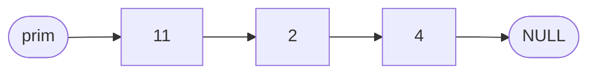
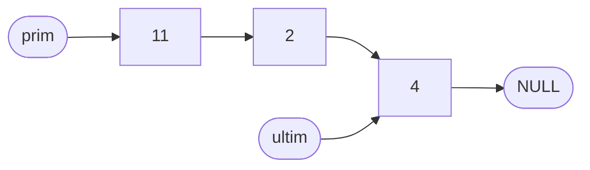
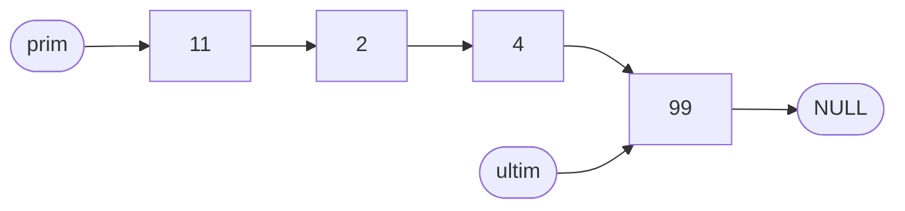
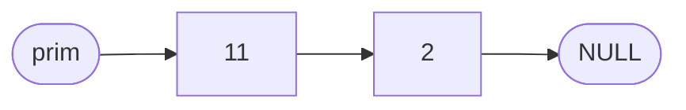
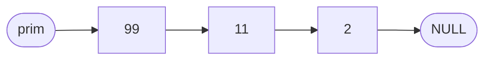
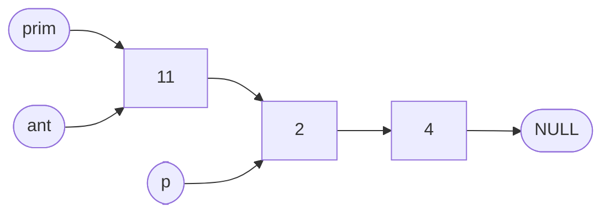
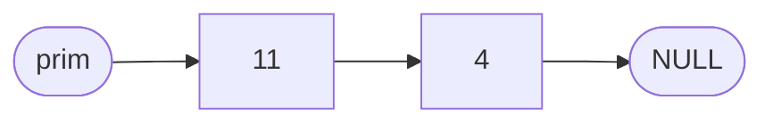

# Liste inlantuite

O **lista liniara simplu inlantuita** este o structura de date formata din **noduri** legate intre ele prin pointeri. Fiecare nod contine:
- o **informatie utila** — datele pe care vrem sa le memoram
- **adresa urmatorului nod** din lista

Spre deosebire de tablou (unde elementele sunt in locatii consecutive de memorie), nodurile listei pot fi raspandite oriunde in heap si sunt legate prin campul pointer.

**Avantaje fata de tablou:** inserarea si stergerea unui element nu necesita mutarea celorlalte elemente.

**Dezavantaj fata de tablou:** nu putem accesa direct elementul de pe pozitia `k` — trebuie sa parcurgem lista de la inceput pana la acel element.

---

## Structura unui nod

```cpp
struct Nod {
    int info;
    Nod *leg;
};
```

- `info` — informatia memorata in nod (poate fi orice tip: `int`, `float`, struct etc.)
- `leg` — pointerul catre urmatorul nod; ultimul nod are `leg = NULL`

Pointer-ul catre primul nod al listei se numeste **prim**. Daca lista este goala, `prim = NULL`.



> **Obs:** Fiecare nod este alocat pe heap cu `new`. Un struct poate contine ca si camp un pointer catre el insusi (`Nod *leg`).

---

## Creare nod nou

```cpp
Nod* nod_nou = new Nod;
nod_nou->info = valoare;
nod_nou->leg = NULL;
```

---

## Adaugare la sfarsit

Mentinem un pointer `ultim` catre ultimul nod pentru a adauga eficient fara sa parcurgem toata lista:

```cpp
if (prim == NULL)       // lista goala
{
    prim = nod_nou;
    ultim = nod_nou;
}
else                    // lista are cel putin un nod
{
    ultim->leg = nod_nou;
    ultim = nod_nou;
}
```

**Inainte** (adaugam nodul cu valoarea `99`):



**Dupa** (`ultim->leg = nod_nou`, apoi `ultim = nod_nou`):



> **Obs:** Adaugarea la sfarsit cu ajutorul lui `ultim` se face in timp constant — nu depinde de lungimea listei.

---

## Adaugare la inceput

```cpp
nod_nou->leg = prim;
prim = nod_nou;
```

**Inainte** (adaugam nodul cu valoarea `99`):



**Dupa** (`nod_nou->leg = prim`, apoi `prim = nod_nou`):



> **Obs:** Adaugarea la inceput este mai simpla dar inverseaza ordinea fata de ordinea citirii. Daca citim `1, 2, 3` si adaugam la inceput, lista va fi `3 → 2 → 1`.

---

## Parcurgere

Parcurgem lista cu un pointer `p` care porneste de la `prim` si avanseaza cu `p = p->leg` pana ajunge la `NULL`:

```cpp
Nod* p = prim;
while (p != NULL)
{
    cout << p->info << " ";
    p = p->leg;
}
```

---

## Stergere

### Stergere de la inceput

```cpp
if (prim != NULL)
{
    Nod* aux = prim;
    prim = prim->leg;
    delete aux;
}
```

### Stergere nod cu o valoare data

Vrem sa stergem primul nod cu `info == x`. Mentinem un pointer `ant` (anterior) la nodul dinaintea celui de sters:

```cpp
Nod *p = prim, *ant = NULL;
while (p != NULL && p->info != x)
{
    ant = p;
    p = p->leg;
}
if (p != NULL)
{
    if (ant == NULL)
        prim = p->leg;      // nodul de sters este chiar primul
    else
        ant->leg = p->leg;
    delete p;
}
```

**Inainte** (stergem nodul cu valoarea `2`; `ant` este pe `11`, `p` este pe `2`):



**Dupa** (`ant->leg = p->leg`, apoi `delete p`):



> **Obs:** Daca `ant == NULL`, nodul de sters este primul din lista si actualizam `prim`. Altfel, "sarim" peste nod conectand `ant` direct la urmatorul.

---

## Probleme rezolvate

### Problema 1: Construire lista si afisare

**Enunt:** Se citeste `n`, apoi `n` numere intregi. Sa se construiasca o lista inlantuita (in ordinea citirii) si sa se afiseze elementele listei.

**Solutie:**

```cpp
#include <iostream>
using namespace std;

struct Nod {
    int info;
    Nod *leg;
};

int n, i, x;
Nod *prim, *ultim;

int main()
{
    prim = NULL;
    ultim = NULL;

    cin >> n;
    for (i = 1; i <= n; i++)
    {
        cin >> x;
        Nod* nod_nou = new Nod;
        nod_nou->info = x;
        nod_nou->leg = NULL;
        if (prim == NULL)
        {
            prim = nod_nou;
            ultim = nod_nou;
        }
        else
        {
            ultim->leg = nod_nou;
            ultim = nod_nou;
        }
    }

    Nod* p = prim;
    while (p != NULL)
    {
        cout << p->info << " ";
        p = p->leg;
    }
    cout << endl;
    return 0;
}
```

**Intrare:**
```
5
10 20 30 40 50
```

**Afisare:**
```
10 20 30 40 50
```

> **Obs:** `prim` pointeaza catre primul nod, `ultim` catre ultimul. Dupa adaugarea unui nod la sfarsit, `ultim` avanseaza la noul nod.

### Problema 2: Suma elementelor listei

**Enunt:** Se citeste `n`, apoi `n` numere intregi. Sa se construiasca o lista inlantuita si sa se afiseze suma elementelor.

**Solutie:**

```cpp
#include <iostream>
using namespace std;

struct Nod {
    int info;
    Nod *leg;
};

int n, i, x;
Nod *prim, *ultim;
long long suma;

int main()
{
    prim = NULL;
    ultim = NULL;

    cin >> n;
    for (i = 1; i <= n; i++)
    {
        cin >> x;
        Nod* nod_nou = new Nod;
        nod_nou->info = x;
        nod_nou->leg = NULL;
        if (prim == NULL)
        {
            prim = nod_nou;
            ultim = nod_nou;
        }
        else
        {
            ultim->leg = nod_nou;
            ultim = nod_nou;
        }
    }

    suma = 0;
    Nod* p = prim;
    while (p != NULL)
    {
        suma += p->info;
        p = p->leg;
    }
    cout << suma << endl;
    return 0;
}
```

**Intrare:**
```
5
10 20 30 40 50
```

**Afisare:**
```
150
```

### Problema 3: Verificare prima jumatate = a doua jumatate (FLsiDublu)

**Enunt:** Se da o lista liniara simplu inlantuita cu `n` noduri. Sa se scrie o functie cu prototipul:

```cpp
int FLsiDublu(Nod *prim);
```

care verifica daca primele `n/2` noduri formeaza un sir identic cu ultimele `n/2` noduri. Daca da, returneaza informatia din al `n/2`-lea nod. Daca nu (inclusiv cand `n` este impar), returneaza `-1`.

**Exemple:**
- `11, 2, 4, 11, 2, 4` → `n = 6`, primele 3 = ultimele 3 → returneaza `4` (al 3-lea nod)
- `2, 1, 4, 2, 1, 5` → primele 3 ≠ ultimele 3 → returneaza `-1`
- `2, 1, 5, 6, 2, 1, 5` → `n = 7` (impar) → returneaza `-1`

**Solutie:**

```cpp
#include <iostream>
using namespace std;

struct Nod {
    int info;
    Nod *leg;
};

int FLsiDublu(Nod *prim)
{
    // numaram nodurile
    int n = 0;
    Nod *p = prim;
    while (p != NULL)
    {
        n++;
        p = p->leg;
    }

    if (n % 2 != 0)
        return -1;

    int jum = n / 2;
    int* a = new int[jum + 1];
    int i;

    // memoram informatiile din prima jumatate
    p = prim;
    for (i = 1; i <= jum; i++)
    {
        a[i] = p->info;
        p = p->leg;
    }

    // p se afla acum pe primul nod al jumatii a doua
    // comparam cele doua jumatati
    int rez = a[jum];
    for (i = 1; i <= jum; i++)
    {
        if (a[i] != p->info)
        {
            rez = -1;
            break;
        }
        p = p->leg;
    }

    delete[] a;
    return rez;
}

int n, i, x;
Nod *prim, *ultim;

int main()
{
    prim = NULL;
    ultim = NULL;

    cin >> n;
    for (i = 1; i <= n; i++)
    {
        cin >> x;
        Nod* nod_nou = new Nod;
        nod_nou->info = x;
        nod_nou->leg = NULL;
        if (prim == NULL)
        {
            prim = nod_nou;
            ultim = nod_nou;
        }
        else
        {
            ultim->leg = nod_nou;
            ultim = nod_nou;
        }
    }

    cout << FLsiDublu(prim) << endl;
    return 0;
}
```

**Intrare:**
```
6
11 2 4 11 2 4
```

**Afisare:**
```
4
```

> **Obs:** Parcurgem lista o data pentru a numara nodurile. Apoi parcurgem inca o data: prima jumatate o memoram in tabloul `a`, iar cand ajungem la jumatatea a doua, comparam element cu element. Pointerul `p` ramane pe primul nod din jumatatea a doua dupa primul `for`.

> **Obs:** Pe pbinfo, functia se trimite fara `main` si fara codul de construire a listei — grader-ul furnizeaza lista gata construita prin pointerul `prim`. Atentie: in enuntul de pe pbinfo, parametrul poate fi numit `head` — la trimitere redenumeste-l conform cerintei.
