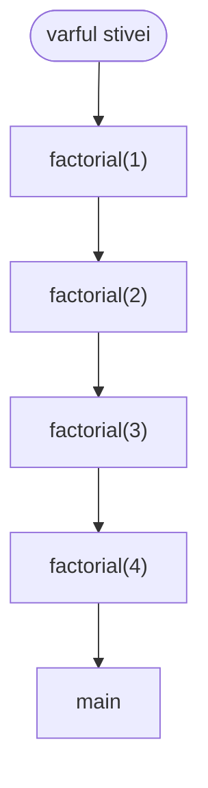
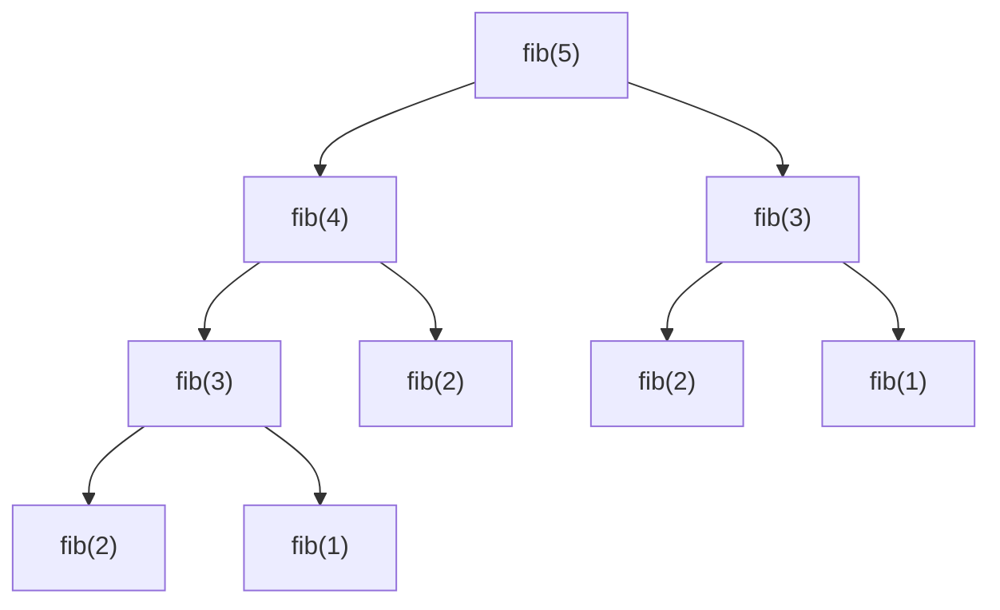
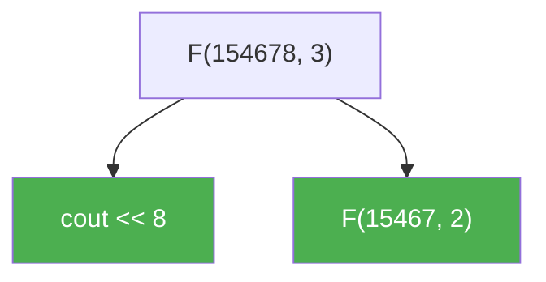
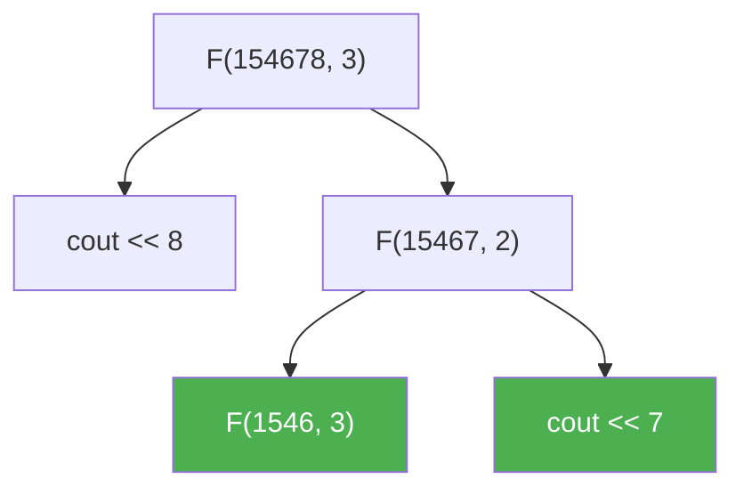
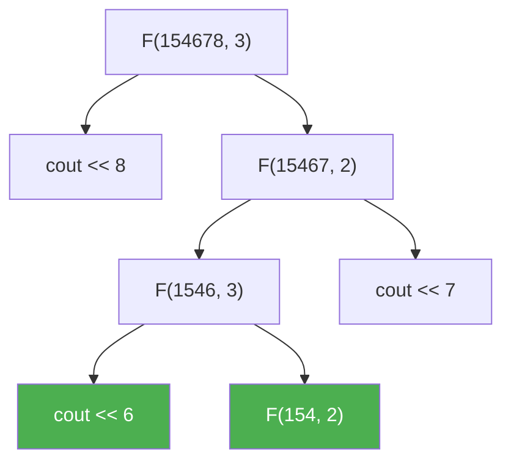
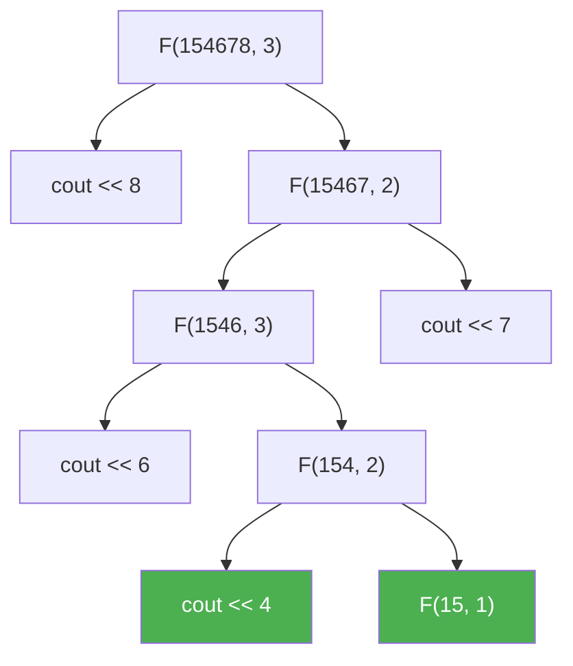
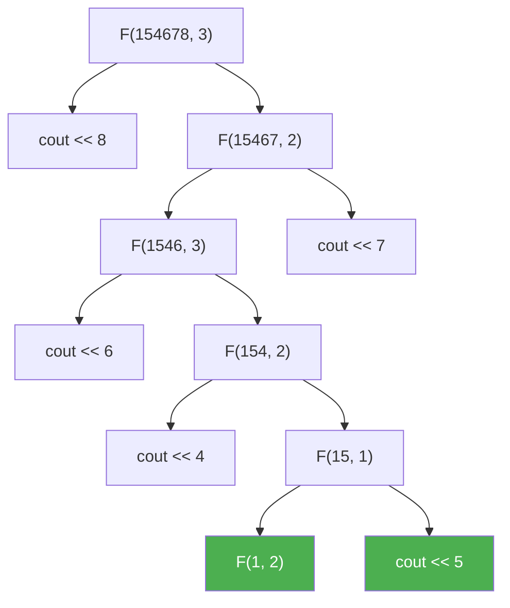
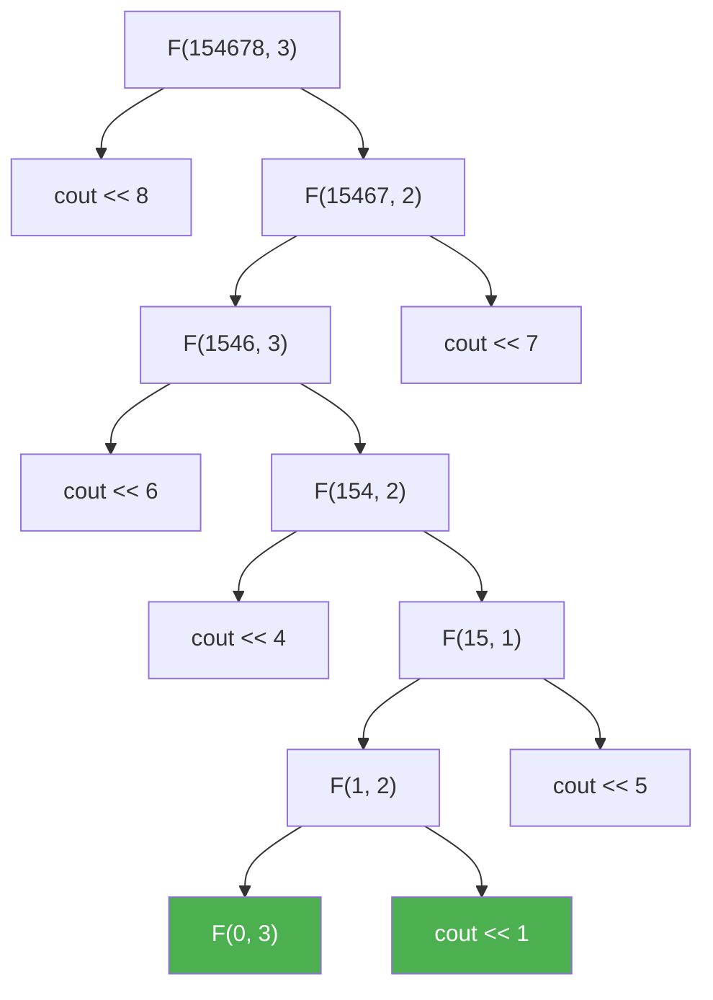
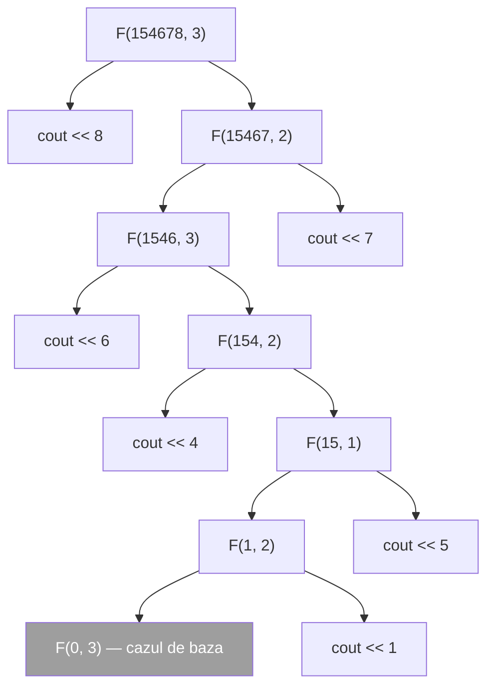
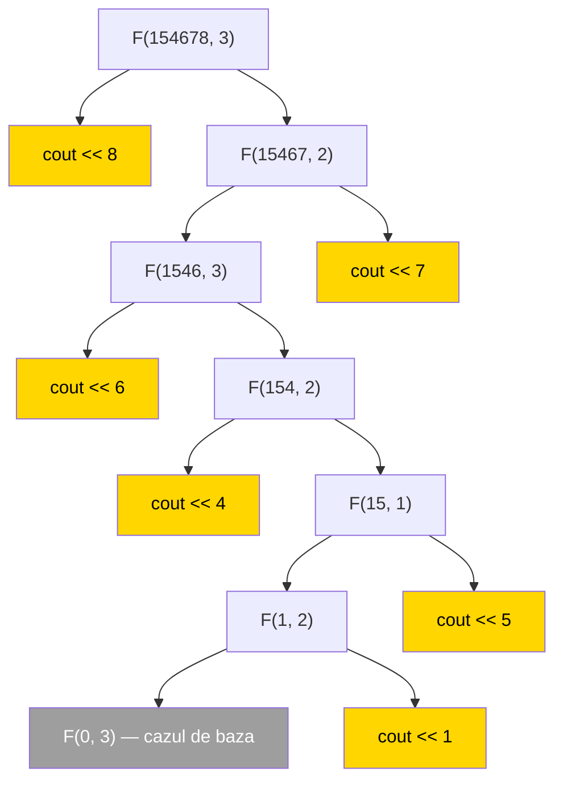

# Recursie

O **functie recursiva** este o functie care contine in definitia ei apeluri ale ei insasi. Altfel spus: o functie care ajunge sa se apeleze pe ea insasi.

La prima vedere pare imposibil — cum poate o functie sa se foloseasca de ea insasi inainte sa fie gata? Raspunsul este ca **fiecare apel este independent** de celelalte: are propriii parametri si propriile variabile locale, exact ca doua apeluri ale unor functii diferite. Am vazut asta in lectia de [functii](./functii#stiva-de-apeluri-call-stack) — fiecare apel primeste un **cadru** nou pe stiva de apeluri.

---

## Recursie directa si indirecta

### Recursie directa

Apelul functiei apare **chiar in definitia ei**.

```cpp
void f()
{
    // ...
    f();
    // ...
}
```

### Recursie indirecta

In definitia functiei **nu** gasim niciun apel al ei, dar functia ajunge totusi sa se apeleze pe sine, prin intermediul altei functii.

```cpp
void y();   // declararea lui y, pentru ca il folosim in x

void x()
{
    // ...
    y();
    // ...
}
void y()
{
    // ...
    x();
    // ...
}
```

`x` il apeleaza pe `y`, iar `y` il apeleaza pe `x`. Deci `x` ajunge sa se apeleze pe sine, desi in corpul lui `x` nu scrie nicaieri `x()`.

> [!NOTE] Observatie
> `void y();` de deasupra lui `x` este o **declarare** de functie (vezi [Declararea unei functii](./functii#declararea-unei-functii)). Fara ea, compilatorul nu ar sti ce este `y` in momentul in care citeste corpul lui `x`. La recursia indirecta declararea este obligatorie: oricum am aseza cele doua functii, una o foloseste pe cealalta inainte sa fie definita.

> [!IMPORTANT] Important
> Materia de liceu (si, in mare parte, si cea de facultate) se ocupa **doar de recursia directa**. E bine sa stii ce inseamna recursia indirecta, dar problemele pe care le vei rezolva folosesc recursia directa.

---

## Recapitulare — ce se intampla cand se apeleaza o functie

1. Se memoreaza locul in cod de unde se apeleaza functia.
2. Se copiaza pe stiva valorile parametrilor (intr-un apel nou).
3. Se executa codul functiei.
4. Dupa terminarea functiei, executia continua din locul memorat la pasul 1.
5. Apelul se sterge de pe stiva, impreuna cu tot ce contine (parametri si variabile locale).

Zona de memorie in care se memoreaza apelurile de functie se numeste **stiva** (in engleza *stack*).

> [!IMPORTANT] Important
> Fiind o zona de memorie, stiva este **finita**. NU pot sa am o infinitate de apeluri pe stiva.

---

## Recursie infinita si stack overflow

Putem, din greseala, sa scriem o functie recursiva care se apeleaza pe sine la nesfarsit. Fenomenul se numeste **recursie infinita**.

```cpp
void f()
{
    cout << "Hello\n";
    f();
}
```

Functia afiseaza `Hello`, apoi se apeleaza pe sine, afiseaza din nou `Hello`, se apeleaza din nou... la infinit. Pe ecran apare `Hello` de foarte multe ori, pana cand programul "crapa".

```cpp
void f()
{
    f();
    cout << "Hello\n";
}
```

Aici se intra tot in recursie infinita, dar functia **nu afiseaza niciodata nimic**: prima instructiune este apelul recursiv, iar la `cout` nu se ajunge niciodata.

> [!WARNING] Atentie
> Fiecare apel ocupa loc pe stiva, iar stiva este finita. La o recursie infinita, stiva se umple pana la refuz, iar cand programul incearca sa mai adauge inca un apel, se opreste brusc cu eroare. Fenomenul se numeste **stack overflow** (*stack* — stiva, *overflow* — "a da pe afara", inundatie).

---

## Cum "gandim" o functie recursiva

Orice functie recursiva corect scrisa are **doua parti**:

**1. Cazul de baza** (sau cazul banal)

- cazul in care raspunsul este "banal", il stim direct, fara sa mai calculam nimic;
- este momentul in care recursia **se opreste**.

**2. Cazul general**

- partea in care recursia merge mai departe;
- aici se afla **apelul recursiv**.

> [!IMPORTANT] Promisiune
> Ma voi asigura **intotdeauna** ca in momentul in care tratez cazul banal opresc executia (cu `return`).

> [!TIP] Sfat
> In scrierea functiei tratez **prima data cazul banal**. De ce? Ca sa ma asigur ca NU am recursie infinita.

Sablonul general arata asa:

```cpp
tipReturnat functie(parametri)
{
    if (cazul de baza)
        return raspunsul banal;

    // cazul general
    return ceva care foloseste functie(parametri mai mici);
}
```

> [!IMPORTANT] Important
> Apelul recursiv trebuie sa se faca pentru date **mai mici**, care se apropie de cazul de baza. Daca apelez `f(n)` din `f(n)`, nu ma apropii niciodata de oprire.

---

## Exemplu — n factorial

Stim ca `n! = 1 * 2 * 3 * ... * n`. Sa privim factorialul ca pe un **sir**:

```
f(n) = f(n - 1) * n     (cazul general)
f(1) = 1                (cazul de baza)
```

Cazul de baza este `f(1) = 1`, pentru ca `1! = 1` si il stim direct, fara niciun calcul.

Functia se scrie exact dupa aceste doua relatii:

```cpp
int factorial(int n)
{
    if (n <= 1) return 1;              // cazul de baza
    return n * factorial(n - 1);       // cazul general
}
```

> [!NOTE] Observatie
> Am scris `n <= 1`, nu `n == 1`, ca sa acoperim si `0! = 1`, si eventualele apeluri cu valori negative — asa functia se opreste in orice situatie.

### Derularea apelurilor pentru `factorial(4)`

**Coborarea** — fiecare apel il face pe urmatorul si **asteapta** rezultatul lui:

```
factorial(4) = 4 * factorial(3)
factorial(3) = 3 * factorial(2)
factorial(2) = 2 * factorial(1)
factorial(1) = 1                  <- cazul de baza, aici se opreste recursia
```

In acest moment, pe stiva sunt **patru** apeluri ale lui `factorial`, plus `main`:



**Urcarea** — de la cazul de baza in sus, fiecare apel isi termina calculul si intoarce rezultatul apelului de sub el:

```
factorial(1) = 1
factorial(2) = 2 * 1 = 2
factorial(3) = 3 * 2 = 6
factorial(4) = 4 * 6 = 24
```

> [!NOTE] Observatie
> Fiecare apel are **propriul** `n`: in cadrul din varf `n` este `1`, in cel de sub el `n` este `2` si asa mai departe. Sunt patru variabile `n` diferite, care exista in acelasi timp pe stiva.

### Programul complet

```cpp
#include <iostream>
using namespace std;

int nr;

int factorial(int n)
{
    if (n <= 1) return 1;
    return n * factorial(n - 1);
}
int main()
{
    cin >> nr;
    cout << factorial(nr);
    return 0;
}
```

**Intrare:**
```
4
```

**Afisare:**
```
24
```

### Sa vedem stiva crescand si scazand

Ruleaza programul pas cu pas si urmareste panoul stivei din dreapta. Este acelasi program de mai sus, cu `4` la intrare.

<DebuggerVisual trace="factorial" :heap="false" titlu="factorial(4) — patru apeluri ale aceleiasi functii pe stiva" />

Ce se vede:

- La inceput exista doar `main`. Apoi apare primul cadru de `factorial`, cu `n` egal cu `4`.
- Fiecare cadru nou apare **deasupra** celui dinainte si are propriul `n`: `4`, `3`, `2`, `1`. Toate cele patru variabile `n` exista in acelasi timp, fiecare in cadrul ei.
- La `n` egal cu `1` se intra pe ramura cazului de baza si recursia **nu mai coboara** — de aici stiva incepe sa scada.
- Cadrele dispar in ordine inversa fata de cea in care au aparut, iar fiecare intoarce rezultatul in cadrul de **sub** el: `1`, apoi `2`, apoi `6`, apoi `24`.

> [!IMPORTANT] Important
> Cele patru cadre sunt ale **aceleiasi** functii, dar sunt apeluri diferite, cu valori diferite pentru `n`. Exact asta face recursia posibila: un apel nu "strica" parametrii altui apel.

> [!WARNING] Atentie
> `int` tine numere pana la aproximativ 2 miliarde, deci `factorial` da rezultate corecte doar pana la `12!` (`479001600`). Deja `13!` depaseste `int` si se obtine un rezultat gresit. Pentru valori mai mari se foloseste `long long` (pana la `20!`).

> [!WARNING] Eroare la compilare
> O greseala des intalnita este sa scriem `void` in loc de `int`:
>
> ```cpp
> void factorial(int n)
> {
>     if (n <= 1) return 1;
>     return n * factorial(n - 1);
> }
> ```
>
> ```
> error: return-statement with a value, in function returning 'void'
> ```
>
> Functia intoarce un numar, deci tipul returnat trebuie sa fie `int`.

---

## Exemplu — suma primelor n numere naturale

```
s(n) = s(n - 1) + n     (cazul general)
s(0) = 0                (cazul de baza)
```

```cpp
#include <iostream>
using namespace std;

int nr;

int suma(int n)
{
    if (n == 0) return 0;
    return suma(n - 1) + n;
}
int main()
{
    cin >> nr;
    cout << suma(nr);
    return 0;
}
```

**Intrare:**
```
5
```

**Afisare:**
```
15
```

Derularea pentru `suma(5)`: `suma(5)` asteapta `suma(4)`, care asteapta `suma(3)`, ... pana la `suma(0)`, care intoarce `0`. Apoi, la urcare: `0`, `0 + 1 = 1`, `1 + 2 = 3`, `3 + 3 = 6`, `6 + 4 = 10`, `10 + 5 = 15`.

---

## Inainte si dupa apelul recursiv

Aceasta este ideea cea mai importanta din lectie. Instructiunile scrise **inainte** de apelul recursiv se executa "la coborare", iar cele scrise **dupa** apelul recursiv se executa "la urcare" — adica in ordine **inversa**.

Sa comparam doua functii care difera printr-un singur lucru: ordinea celor doua instructiuni.

### Afisarea inainte de apel

```cpp
#include <iostream>
using namespace std;

int nr;

void afisare(int n)
{
    if (n == 0) return;
    cout << n << " ";
    afisare(n - 1);
}
int main()
{
    cin >> nr;
    afisare(nr);
    return 0;
}
```

**Intrare:**
```
5
```

**Afisare:**
```
5 4 3 2 1
```

Fiecare apel afiseaza **inainte** sa coboare mai departe, deci numerele apar in ordinea in care se fac apelurile: `5`, `4`, `3`, `2`, `1`.

### Afisarea dupa apel

```cpp
#include <iostream>
using namespace std;

int nr;

void afisare(int n)
{
    if (n == 0) return;
    afisare(n - 1);
    cout << n << " ";
}
int main()
{
    cin >> nr;
    afisare(nr);
    return 0;
}
```

**Intrare:**
```
5
```

**Afisare:**
```
1 2 3 4 5
```

Aici fiecare apel coboara **mai intai** pana la capat si abia apoi afiseaza. Primul care apuca sa afiseze este apelul cel mai adanc, `afisare(1)`, apoi `afisare(2)` si asa mai departe — deci numerele apar in ordine inversa fata de ordinea apelurilor.

> [!TIP] Sfat
> Cand nu esti sigur ce afiseaza o functie recursiva, intreaba-te: instructiunea de afisare este **inainte** sau **dupa** apelul recursiv?
> - inainte → ordinea apelurilor (de la `n` catre cazul de baza);
> - dupa → ordinea inversa (de la cazul de baza catre `n`).

---

## Exemplu — suma cifrelor unui numar

```
sc(n) = n % 10 + sc(n / 10)     (cazul general)
sc(0) = 0                       (cazul de baza)
```

Ultima cifra este `n % 10`, iar `n / 10` este numarul fara ultima cifra — deci o problema **mai mica**, de acelasi fel.

```cpp
#include <iostream>
using namespace std;

int nr;

int sumaCifrelor(int n)
{
    if (n == 0) return 0;
    return n % 10 + sumaCifrelor(n / 10);
}
int main()
{
    cin >> nr;
    cout << sumaCifrelor(nr);
    return 0;
}
```

**Intrare:**
```
2735
```

**Afisare:**
```
17
```

Derulare: `sumaCifrelor(2735) = 5 + sumaCifrelor(273) = 5 + 3 + sumaCifrelor(27) = 5 + 3 + 7 + sumaCifrelor(2) = 5 + 3 + 7 + 2 + sumaCifrelor(0) = 17`.

---

## Exemplu — afisarea cifrelor in ordine

Daca afisam `n % 10` **inainte** de apel, cifrele ies in ordine inversa (`5 3 7 2`). Ca sa le obtinem in ordinea normala, punem afisarea **dupa** apelul recursiv:

```cpp
#include <iostream>
using namespace std;

int nr;

void afisareCifre(int n)
{
    if (n == 0) return;
    afisareCifre(n / 10);
    cout << n % 10 << " ";
}
int main()
{
    cin >> nr;
    afisareCifre(nr);
    return 0;
}
```

**Intrare:**
```
2735
```

**Afisare:**
```
2 7 3 5
```

> [!WARNING] Atentie
> Pentru `nr` egal cu `0`, functia intra direct in cazul de baza si **nu afiseaza nimic**, desi numarul `0` are o cifra. Daca problema cere si acest caz, il tratam separat in `main`:
>
> ```cpp
> if (nr == 0)
>     cout << 0;
> else
>     afisareCifre(nr);
> ```

---

## Exemplu — afisarea unui numar in baza 2

Acelasi tipar, dar cu impartiri la `2`: restul `n % 2` este ultima cifra binara, iar `n / 2` este numarul fara ea. Cifrele se obtin de la ultima catre prima, deci afisam **dupa** apelul recursiv.

```cpp
#include <iostream>
using namespace std;

int nr;

void baza2(int n)
{
    if (n == 0) return;
    baza2(n / 2);
    cout << n % 2;
}
int main()
{
    cin >> nr;
    baza2(nr);
    return 0;
}
```

**Intrare:**
```
11
```

**Afisare:**
```
1011
```

> [!TIP] Sfat
> Recursia rezolva aici o problema pe care varianta cu `while` o are: cu `while` obtinem cifrele binare de la dreapta la stanga si trebuie sa le pastram intr-un vector ca sa le putem afisa in ordine. Recursia le "pastreaza" chiar pe stiva de apeluri.

---

## Exemplu — sirul lui Fibonacci

```
fib(n) = fib(n - 1) + fib(n - 2)     (cazul general)
fib(1) = 1, fib(2) = 1               (cazurile de baza)
```

Aici avem **doua** cazuri de baza si **doua** apeluri recursive.

```cpp
#include <iostream>
using namespace std;

int nr;

int fibonacci(int n)
{
    if (n <= 2) return 1;
    return fibonacci(n - 1) + fibonacci(n - 2);
}
int main()
{
    cin >> nr;
    cout << fibonacci(nr);
    return 0;
}
```

**Intrare:**
```
10
```

**Afisare:**
```
55
```

Pentru `fibonacci(5)`, apelurile nu mai formeaza un lant, ci un **arbore**:



> [!WARNING] Atentie
> Priveste arborele: `fib(3)` se calculeaza de **doua** ori, iar `fib(2)` de **trei** ori. Numarul de apeluri creste exponential — pentru `n` egal cu `40` programul face sute de milioane de apeluri si ruleaza cateva secunde, iar pentru `n` egal cu `50` nu se mai termina intr-un timp rezonabil.
>
> Functia recursiva de mai sus este **corecta**, dar **ineficienta**. Pentru valori mari ale lui `n`, sirul lui Fibonacci se calculeaza iterativ, cu un `for` care retine ultimele doua valori.

---

## Exemplu — cel mai mare divizor comun

Algoritmul lui Euclid cu impartiri se scrie foarte natural recursiv:

```
cmmdc(a, b) = cmmdc(b, a % b)     (cazul general)
cmmdc(a, 0) = a                   (cazul de baza)
```

```cpp
#include <iostream>
using namespace std;

int x, y;

int cmmdc(int a, int b)
{
    if (b == 0) return a;
    return cmmdc(b, a % b);
}
int main()
{
    cin >> x >> y;
    cout << cmmdc(x, y);
    return 0;
}
```

**Intrare:**
```
24 36
```

**Afisare:**
```
12
```

Derulare: `cmmdc(24, 36)` → `cmmdc(36, 24)` → `cmmdc(24, 12)` → `cmmdc(12, 0)` → `12`.

> [!NOTE] Observatie
> Cazul de baza este atins sigur: restul `a % b` este mereu mai mic decat `b`, deci al doilea parametru scade la fiecare apel si ajunge inevitabil la `0`.

---

## Recursie sau instructiune repetitiva?

Aproape orice functie recursiva poate fi rescrisa cu un `for` sau un `while`, si invers. Compara cele doua variante pentru factorial:

```cpp
int factorial(int n)
{
    if (n <= 1) return 1;
    return n * factorial(n - 1);
}
```

```cpp
int factorial(int n)
{
    int p = 1, i;
    for (i = 2; i <= n; i++)
        p = p * i;
    return p;
}
```

| | Recursiv | Iterativ (`for` / `while`) |
|---|---|---|
| Cod | de obicei mai scurt, copiaza relatia matematica | ceva mai lung |
| Memorie | un cadru pe stiva pentru **fiecare** apel | o singura zona de memorie |
| Risc | stack overflow la adancime mare | fara acest risc |
| Se preteaza la | probleme definite prin recurenta, parcurgeri de structuri (mai tarziu: backtracking, arbori) | calcule simple, parcurgeri de vectori |

> [!TIP] Sfat
> Recursia nu este "mai buna" sau "mai rea" decat un `for`. O folosim atunci cand problema **se defineste** in termeni de ea insasi — atunci codul recursiv este mai scurt si mai usor de citit decat echivalentul iterativ.

> [!WARNING] Atentie
> Pe stiva incap, in mod uzual, cateva zeci de mii de apeluri. O functie recursiva cu adancimea `n` este in regula pentru `n` de ordinul miilor, dar o recursie de adancime un milion da **stack overflow**, chiar daca este scrisa corect.

---

## Capcane frecvente

### 1. Lipseste cazul de baza

```cpp
int factorial(int n)
{
    return n * factorial(n - 1);   // nu se opreste niciodata
}
```

Nu exista nicio conditie care sa opreasca recursia: `n` scade la `0`, apoi devine negativ si continua la infinit. Rezultat: **stack overflow**.

### 2. Cazul de baza nu opreste executia

```cpp
int factorial(int n)
{
    int rez = 1;
    if (n <= 1) rez = 1;
    rez = n * factorial(n - 1);   // se executa MEREU, si pentru n == 1
    return rez;
}
```

Aici cazul de baza este scris, dar nu opreste nimic: dupa `if` executia continua si se face oricum apelul recursiv. Corect este sa iesim din functie cu `return`:

```cpp
int factorial(int n)
{
    if (n <= 1) return 1;
    return n * factorial(n - 1);
}
```

### 3. Apelul recursiv nu se apropie de cazul de baza

```cpp
int factorial(int n)
{
    if (n <= 1) return 1;
    return n * factorial(n);   // n ramane acelasi
}
```

Cazul de baza exista si opreste executia, dar nu se ajunge niciodata la el: fiecare apel il face pe urmatorul cu **aceeasi** valoare a lui `n`.

### 4. Tipul returnat este `void`, dar functia intoarce o valoare

```cpp
void factorial(int n)
{
    if (n <= 1) return 1;
    return n * factorial(n - 1);
}
```

```
error: return-statement with a value, in function returning 'void'
```

`void` se foloseste doar pentru functii care **nu** intorc nimic — cum este `afisare` din exemplele de mai sus, care doar scrie pe ecran.

---

## Arborele de executie — cum aflam ce afiseaza o functie recursiva

La BAC apare foarte des cerinta "ce se afiseaza in urma apelului ...". Daca incerci sa urmaresti apelurile in minte, te incurci dupa doua-trei niveluri. Exista insa o metoda sigura, care se face pe hartie si nu cere nimic memorat: **desenam arborele de executie**.

### Exercitiul

Subprogramul `F` este definit mai jos ([exercitiul #492 de pe pbinfo](https://www.pbinfo.ro/?pagina=itemi-evaluare&id=492), Bacalaureat 2015):

```cpp
void F(long a, int b)
{
    if (a * b != 0)
        if (a % 2 == 0)
        {
            cout << a % 10;
            F(a / 10, b - 1);
        }
        else
        {
            F(a / 10, b + 1);
            cout << a % 10;
        }
}
```

Ce se afiseaza in urma apelului urmator?

```cpp
F(154678, 3);
```

> [!NOTE] Observatie
> `else` se leaga intotdeauna de **cel mai apropiat** `if` de dinaintea lui — aici de `if (a % 2 == 0)`, nu de `if (a * b != 0)`. Deci, cand `a * b` este `0`, nu se executa **nimic**: acesta este cazul de baza.

### Regulile desenului

- **Radacina** arborelui este chiar **apelul initial**.
- **Fiii unui nod** sunt instructiunile care se executa efectiv in acel apel, **in ordinea din cod**, de la stanga la dreapta.
- Un fiu care este **apel de functie** se desface mai departe, dupa aceleasi reguli.
- Un fiu care este **`cout`** este frunza — nu mai are ce desface.
- Un apel care intra pe cazul de baza este frunza: **nu are niciun fiu**.

La fiecare nod avem de raspuns la doua intrebari: *intru in functie?* (`a * b != 0`) si, daca da, *pe ce ramura?* (`a % 2 == 0` sau nu). A doua intrebare decide **ordinea** fiilor.

### Pasul 1 — radacina si fiii ei

`F(154678, 3)`: `a * b` este `464034`, deci intram. `a` este **par**, deci ramura `if`: intai `cout << a % 10`, adica `8`, apoi apelul `F(a / 10, b - 1)`, adica `F(15467, 2)`.



### Pasul 2 — desfacem `F(15467, 2)`

`a * b` este `30934`, deci intram. `a` este **impar**, deci ramura `else`: intai apelul `F(a / 10, b + 1)`, adica `F(1546, 3)`, si abia dupa `cout << a % 10`, adica `7`.



> [!WARNING] Atentie
> Aici este locul unde se greseste cel mai des. `cout << 7` este scris in cod **dupa** apelul recursiv, deci in arbore este fiul **din dreapta** — se va executa dupa tot ce se afla in subarborele lui `F(1546, 3)`.

### Pasul 3 — desfacem `F(1546, 3)`

`a * b` este `4638`, deci intram. `a` este **par**: intai `cout << 6`, apoi `F(154, 2)`.



### Pasul 4 — desfacem `F(154, 2)`

`a * b` este `308`, deci intram. `a` este **par**: intai `cout << 4`, apoi `F(15, 1)`.



### Pasul 5 — desfacem `F(15, 1)`

`a * b` este `15`, deci intram. `a` este **impar**: intai `F(1, 2)`, apoi `cout << 5`.



### Pasul 6 — desfacem `F(1, 2)`

`a * b` este `2`, deci intram. `a` este **impar**: intai `F(0, 3)`, apoi `cout << 1`.



### Pasul 7 — desfacem `F(0, 3)`

`a * b` este `0`, deci **nu** intram in `if`. Apelul se termina fara sa execute nimic: nodul ramane **frunza**, fara niciun fiu. Aici s-a oprit recursia, deci desenul este gata.



### Citirea raspunsului

Acum nu mai avem nimic de calculat: parcurgem arborele **de la stanga la dreapta**, coborand de fiecare data pe fiul din stanga inainte de cel din dreapta, si citim doar frunzele `cout`.



| Ordinea | Frunza `cout` | Din apelul | Cifra |
|---|---|---|---|
| 1 | `cout << 8` | `F(154678, 3)` | `8` |
| 2 | `cout << 6` | `F(1546, 3)` | `6` |
| 3 | `cout << 4` | `F(154, 2)` | `4` |
| 4 | `cout << 1` | `F(1, 2)` | `1` |
| 5 | `cout << 5` | `F(15, 1)` | `5` |
| 6 | `cout << 7` | `F(15467, 2)` | `7` |

**Afisare:**
```
864157
```

> [!NOTE] Observatie
> Cifra `7` se afiseaza **ultima**, desi apelul `F(15467, 2)` este al doilea din tot programul. Motivul se vede in arbore: `cout << 7` este fiul din dreapta, deci se executa dupa intreg subarborele fratelui sau din stanga.

### Programul complet

```cpp
#include <iostream>
using namespace std;

void F(long a, int b)
{
    if (a * b != 0)
        if (a % 2 == 0)
        {
            cout << a % 10;
            F(a / 10, b - 1);
        }
        else
        {
            F(a / 10, b + 1);
            cout << a % 10;
        }
}
int main()
{
    F(154678, 3);
    return 0;
}
```

**Afisare:**
```
864157
```

### De ce functioneaza metoda

Arborele desenat de tine este chiar **arborele apelurilor**: fiecare nod-apel este un cadru care apare pe stiva, iar fiii lui sunt exact ce executa acel cadru cat timp se afla pe stiva. Parcurgerea de la stanga la dreapta este chiar ordinea in care programul executa instructiunile.

Regasesti aici si ideea din sectiunea [Inainte si dupa apelul recursiv](#inainte-si-dupa-apelul-recursiv):
- ramura `if` (`a` par) are `cout` **inainte** de apel, deci scrie **la coborare** — cifra apare devreme;
- ramura `else` (`a` impar) are `cout` **dupa** apel, deci scrie **la urcare** — cifra apare tarziu.

> [!TIP] Sfat
> Reteta, pe scurt, pentru orice exercitiu de tipul "ce afiseaza apelul...":
> 1. Scrie apelul initial ca radacina.
> 2. Pentru nodul curent, verifica daca se intra in functie; daca nu, e frunza si treci mai departe.
> 3. Daca se intra, scrie-i ca fii instructiunile executate, **in ordinea din cod**.
> 4. Repeta pentru fiecare fiu care este apel, pana cand nu mai ai ce desface.
> 5. Citeste frunzele `cout` de la stanga la dreapta.

---

## De retinut

- O functie recursiva se apeleaza pe ea insasi; fiecare apel are propriii parametri si propriul cadru pe stiva.
- Orice functie recursiva are un **caz de baza** (unde raspunsul e banal si recursia se opreste) si un **caz general** (unde se face apelul recursiv).
- Cazul de baza se scrie **primul** si trebuie sa **opreasca** executia.
- Apelul recursiv se face pentru o problema **mai mica**, care se apropie de cazul de baza.
- Instructiunile de **inainte** de apelul recursiv se executa la coborare, cele de **dupa** el la urcare — adica in ordine inversa.
- Fara caz de baza (sau fara apropiere de el) se ajunge la recursie infinita si **stack overflow**.
- La exercitiile de tipul "ce afiseaza apelul...", deseneaza **arborele de executie**: radacina este apelul initial, fiii unui nod sunt instructiunile executate in acel apel, iar raspunsul se citeste parcurgand frunzele `cout` de la stanga la dreapta.
