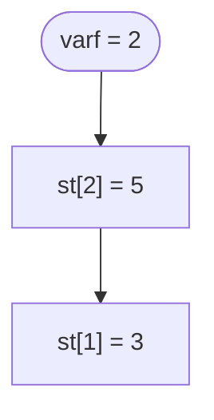
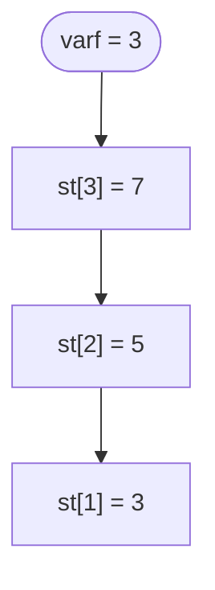

# Stiva

O **stiva** (in engleza *stack*) este o **structura de date abstracta**: nu este un tip predefinit al limbajului, ci un *mod de organizare* a datelor in care conteaza **ordinea** in care adaugam si scoatem elemente.

Regula stivei este una singura:

> **Ultimul element pus este primul care iese.**

Aceasta regula se numeste **LIFO** — *Last In, First Out* (ultimul intrat, primul iesit).

---

## Stiva in viata reala

Desi pare un concept abstract, stiva apare peste tot in jurul nostru. In toate exemplele de mai jos, ai acces **doar la varful** gramezii — nu poti scoate ceva din mijloc fara sa dai jos ce e deasupra:

- **Teancul de farfurii** din bucatarie: pui farfuria spalata deasupra si tot de deasupra iei cand ai nevoie de una.
- **Teancul de tavi** de la cantina: tavile noi se pun peste cele vechi, iar tu o iei pe cea de sus.
- **Un tub de biscuiti**: ultimul biscuite bagat in tub este primul pe care il scoti.
- **Butonul *Back* din browser**: ultima pagina vizitata este prima la care te intorci.
- **Comanda *Undo* (Ctrl+Z)**: anuleaza ultima modificare facuta, apoi pe penultima si asa mai departe.

Toate au acelasi comportament: **adaugi si scoti doar la un singur capat**, numit **varful stivei**.

> [!NOTE] Observatie
> Diferenta fata de o coada (la magazin, la casa de marcat) este ca la coada primul venit este primul servit (FIFO), pe cand la stiva ultimul venit este primul servit (LIFO).

---

## Operatiile cu stiva

O stiva pune la dispozitie un set restrans de operatii. Le explicam folosind paralela cu teancul de farfurii:

| Operatie | In limbaj de stiva | La teancul de farfurii |
|----------|--------------------|------------------------|
| **push** | adauga un element in varf | pui o farfurie deasupra |
| **pop**  | scoate elementul din varf | iei farfuria de deasupra |
| **top**  | citeste elementul din varf, fara sa-l scoata | te uiti ce farfurie e deasupra |
| **stiva vida** | verifici daca nu mai e niciun element | teancul e gol |

Ce **nu** putem face: nu putem citi sau scoate un element din mijlocul stivei, asa cum nu poti trage o farfurie din mijlocul teancului fara sa rastorni tot ce e deasupra.

---

## Reprezentarea cu tablou

Cea mai simpla implementare a unei stive foloseste un **tablou** `st` si o variabila intreaga `varf`, care retine **cati** elemente sunt in stiva (si, totodata, pozitia varfului).

```cpp
int st[100], varf;
```

Conventia pe care o folosim:
- elementele utile stau pe pozitiile `st[1]`, `st[2]`, ..., `st[varf]`;
- `st[varf]` este mereu **varful** stivei (ultimul element adaugat);
- cand `varf` este `0`, **stiva este vida**.


In desenul de mai sus, in stiva avem doua elemente: `3` a fost pus primul (e la baza), iar `5` a fost pus al doilea (e in varf). `varf` are valoarea `2`.

---

### push — adaugare in varf

Pentru a pune un element nou `x` in varf, crestem `varf` cu `1` (apare o pozitie noua deasupra) si scriem acolo valoarea:

```cpp
varf++;
st[varf] = x;
```

**Inainte** (`varf = 2`) — adaugam valoarea `7`:



**Dupa** (`varf++` apoi `st[varf] = 7`):


---

### pop — scoatere din varf

Pentru a scoate elementul din varf este suficient sa **scadem** `varf` cu `1`. Pozitia ramane in tablou, dar nu o mai consideram parte din stiva (urmatorul `push` o va suprascrie):

```cpp
varf--;
```

Daca avem nevoie de valoarea scoasa, o citim **inainte** de a micsora `varf`:

```cpp
x = st[varf];
varf--;
```

**Inainte** (`varf = 3`):



**Dupa** (`varf--`, valoarea `7` a fost scoasa):


> [!WARNING] Atentie
> Nu scoate niciodata dintr-o stiva vida! Inainte de un `pop` sau de a citi varful, verifica intotdeauna ca `varf > 0`. Altfel ajungi sa accesezi `st[0]` sau pozitii negative, ceea ce inseamna citiri/scrieri in afara zonei valide.

---

### top — citirea varfului

Varful stivei este pur si simplu `st[varf]`. Il citim fara sa modificam `varf`:

```cpp
cout << st[varf];
```

### stiva vida

Verificam daca stiva este goala comparand `varf` cu `0`:

```cpp
if (varf == 0)
    cout << "Stiva este vida";
```

> [!TIP] Sfat
> Inainte de a folosi o stiva, initializeaza `varf = 0`. Daca declari `varf` ca variabila globala, este initializat automat cu `0`, dar e bine sa o faci explicit cand stiva e refolosita.

---

## Probleme rezolvate

### Problema 1: Afisarea in ordine inversa

**Enunt:** Se citeste `n`, apoi `n` numere intregi. Sa se afiseze numerele in ordine inversa fata de cea a citirii, folosind o stiva.

**Idee:** Punem toate numerele pe stiva in ordinea citirii. Cand le scoatem, regula LIFO ni le da automat in ordine inversa: ultimul citit iese primul.

```cpp
#include <iostream>
using namespace std;

int st[100], varf;
int n, i, x;

int main()
{
    cin >> n;
    varf = 0;
    for (i = 1; i <= n; i++)
    {
        cin >> x;
        varf++;
        st[varf] = x;
    }

    while (varf > 0)
    {
        cout << st[varf] << " ";
        varf--;
    }
    cout << endl;
    return 0;
}
```

**Intrare:**
```
5
10 20 30 40 50
```

**Afisare:**
```
50 40 30 20 10
```

> [!NOTE] Observatie
> `for`-ul de citire face cate un `push`, iar `while`-ul de afisare face cate un `pop` pana cand stiva se goleste (`varf` ajunge `0`).

---

### Problema 2: Conversie din baza 10 in baza 2

**Enunt:** Se citeste un numar natural `n`. Sa se afiseze reprezentarea lui in baza 2.

**Idee:** Cifrele binare se obtin din **resturile** impartirilor succesive la `2`, dar in **ordine inversa** fata de cum trebuie afisate. Stiva rezolva exact aceasta problema: punem resturile pe stiva pe masura ce le calculam, apoi le scoatem in ordinea corecta.

```cpp
#include <iostream>
using namespace std;

int st[100], varf;
int n;

int main()
{
    cin >> n;
    varf = 0;
    while (n > 0)
    {
        varf++;
        st[varf] = n % 2;
        n = n / 2;
    }

    while (varf > 0)
    {
        cout << st[varf];
        varf--;
    }
    cout << endl;
    return 0;
}
```

**Intrare:**
```
13
```

**Afisare:**
```
1101
```

> [!NOTE] Observatie
> Resturile ies in ordinea `1, 0, 1, 1` (de la cea mai putin semnificativa cifra), dar stiva le intoarce in ordinea corecta `1, 1, 0, 1`. Pentru `n = 0` stiva ramane vida si nu se afiseaza nimic — daca enuntul cere afisarea cifrei `0`, trateaza separat acest caz.

---

### Problema 3: Eliminarea perechilor de litere identice alaturate

**Enunt:** Se citeste un cuvant format din litere mici. Cat timp exista doua litere identice alaturate, ele se elimina (impreuna). Sa se afiseze cuvantul ramas dupa toate eliminarile posibile.

**Idee:** Parcurgem cuvantul caracter cu caracter. Pentru fiecare litera:
- daca este **egala** cu varful stivei, inseamna ca formeaza o pereche cu el — il scoatem (`pop`);
- altfel, o adaugam pe stiva (`push`).

La final, stiva contine exact literele care raman.

```cpp
#include <iostream>
using namespace std;

char st[101];
int varf;
char s[101];
int i;

int main()
{
    cin >> s;
    varf = 0;
    for (i = 0; s[i] != '\0'; i++)
    {
        if (varf > 0 && st[varf] == s[i])
            varf--;
        else
        {
            varf++;
            st[varf] = s[i];
        }
    }

    for (i = 1; i <= varf; i++)
        cout << st[i];
    cout << endl;
    return 0;
}
```

**Intrare:**
```
abbaca
```

**Afisare:**
```
ca
```

> [!NOTE] Observatie
> La intrarea `abbaca`: `a` intra; `b` intra; al doilea `b` se potriveste cu varful si elimina perechea `bb`; apoi `a` se potriveste cu noul varf si elimina perechea `aa`; raman pe stiva `c` si `a`. Caracterul `s[i]` se compara cu `st[varf]` doar daca stiva nu e vida (`varf > 0`).

---

### Problema 4: Verificarea unui palindrom cu stiva

**Enunt:** Se citeste un cuvant. Sa se verifice daca este palindrom (se citeste la fel de la stanga la dreapta si invers), folosind o stiva.

**Idee:** Punem pe stiva **prima jumatate** a cuvantului. Scoaterea din stiva ne da aceste litere in ordine inversa — exact ordinea in care apar in **a doua jumatate** daca cuvantul este palindrom. Comparam, deci, a doua jumatate cu ce scoatem din stiva.

```cpp
#include <iostream>
#include <cstring>
using namespace std;

char st[101];
int varf;
char s[101];
int i, n, estePalindrom;

int main()
{
    cin >> s;
    n = strlen(s);
    varf = 0;

    // punem prima jumatate pe stiva
    for (i = 0; i < n / 2; i++)
    {
        varf++;
        st[varf] = s[i];
    }

    // pentru lungime impara sarim peste litera din mijloc
    if (n % 2 == 1)
        i++;

    // comparam a doua jumatate cu varful stivei
    estePalindrom = 1;
    for (; i < n; i++)
    {
        if (st[varf] != s[i])
        {
            estePalindrom = 0;
            break;
        }
        varf--;
    }

    if (estePalindrom == 1)
        cout << "DA" << endl;
    else
        cout << "NU" << endl;
    return 0;
}
```

**Intrare:**
```
abcba
```

**Afisare:**
```
DA
```

> [!NOTE] Observatie
> Pentru un cuvant de lungime impara, litera din mijloc nu conteaza (se potriveste cu ea insasi), deci o sarim cu `i++`. Dupa primul `for`, `i` are deja valoarea `n / 2`, adica indexul primei litere din a doua jumatate.

---

## Stiva monotona (avansat)

> [!IMPORTANT] Pentru cei avansati
> Sectiunea urmatoare depaseste nivelul unei prime lectii. Citeste-o dupa ce stapanesti bine operatiile de baza.

O **stiva monotona** este o stiva in care elementele raman mereu **ordonate** — fie crescator, fie descrescator de la baza spre varf. Pentru a pastra aceasta proprietate, **inainte** de fiecare `push` scoatem din varf toate elementele care ar strica ordinea.

Stiva monotona este unealta clasica pentru intrebari de tipul *"care este cel mai apropiat element mai mare/mai mic?"*. Tehnica obtine raspunsul pentru toate pozitiile parcurgand sirul o singura data.

### Cel mai apropiat element mai mare la stanga

**Enunt:** Se citeste `n`, apoi `n` numere. Pentru fiecare element, sa se afiseze primul element **mai mare** aflat la stanga lui, sau `-1` daca nu exista.

**Idee:** Tinem pe stiva **indicii** elementelor, astfel incat valorile sa fie in ordine **strict descrescatoare** de la baza spre varf. Pentru fiecare element nou `v[i]`, scoatem din stiva toate valorile mai mici sau egale (nu ne mai pot fi raspuns pentru cele din dreapta). Daca dupa aceste scoateri stiva nu e vida, varful este chiar raspunsul cautat.

```cpp
#include <iostream>
using namespace std;

int v[100], st[100], varf;
int n, i;

int main()
{
    cin >> n;
    for (i = 1; i <= n; i++)
        cin >> v[i];

    varf = 0;
    for (i = 1; i <= n; i++)
    {
        while (varf > 0 && v[st[varf]] <= v[i])
            varf--;

        if (varf == 0)
            cout << -1 << " ";
        else
            cout << v[st[varf]] << " ";

        varf++;
        st[varf] = i;
    }
    cout << endl;
    return 0;
}
```

**Intrare:**
```
5
2 5 3 7 1
```

**Afisare:**
```
-1 -1 5 -1 7
```

> [!NOTE] Observatie
> Pe stiva memoram **indici**, nu valori, pentru a putea citi `v[st[varf]]`. Desi avem o stiva si un `while` interior, fiecare element intra si iese din stiva cel mult o data, deci algoritmul parcurge sirul, in total, in timp liniar.

### Cel mai mare dreptunghi dintr-o histograma

**Enunt:** O histograma este formata din `n` bare alaturate, de latime `1` si inaltimi `h[1], h[2], ..., h[n]`. Sa se afle aria celui mai mare dreptunghi care incape complet sub conturul histogramei.

**Idee:** Pentru fiecare bara vrem sa stim cat de mult se poate "intinde" la stanga si la dreapta un dreptunghi de inaltimea ei — adica pana unde barele sunt cel putin la fel de inalte. Folosim o stiva monotona de **indici**, cu inaltimi crescatoare de la baza spre varf. Cand intalnim o bara mai joasa decat varful, inseamna ca dreptunghiul cu inaltimea varfului nu se mai poate extinde la dreapta: scoatem varful si calculam aria lui. Adaugam la final o bara fictiva de inaltime `0`, care goleste stiva si forteaza calculul pentru toate barele ramase.

```cpp
#include <iostream>
using namespace std;

int h[100005];
int st[100005], varf;
int n, i, ariaMax, arie, latime, inaltime;

int main()
{
    cin >> n;
    for (i = 1; i <= n; i++)
        cin >> h[i];

    h[n + 1] = 0;   // bara fictiva care goleste stiva la final
    varf = 0;
    ariaMax = 0;

    for (i = 1; i <= n + 1; i++)
    {
        while (varf > 0 && h[st[varf]] >= h[i])
        {
            inaltime = h[st[varf]];
            varf--;
            if (varf == 0)
                latime = i - 1;
            else
                latime = i - st[varf] - 1;
            arie = inaltime * latime;
            if (arie > ariaMax)
                ariaMax = arie;
        }
        varf++;
        st[varf] = i;
    }

    cout << ariaMax << endl;
    return 0;
}
```

**Intrare:**
```
6
2 1 5 6 2 3
```

**Afisare:**
```
10
```

> [!NOTE] Observatie
> Dreptunghiul maxim are aria `10` si se obtine din barele de inaltimi `5` si `6` (inaltime `5`, latime `2`). Cand scoatem o bara, latimea dreptunghiului ei se intinde de la bara aflata acum in varf (exclusiv) pana la bara curenta `i` (exclusiv): de aceea `latime = i - st[varf] - 1`. Daca stiva s-a golit, dreptunghiul se intinde de la inceputul histogramei, deci `latime = i - 1`.

> [!TIP] Sfat
> Bara fictiva `h[n + 1] = 0` este un truc des folosit: fiind mai joasa decat orice bara reala, declanseaza scoaterea si calculul ariei pentru toate barele care ar fi ramas pe stiva.
