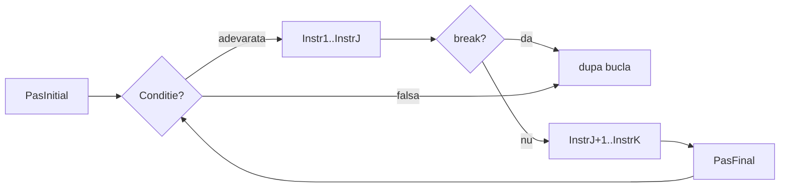

# Instructiunea break

`break` se foloseste in interiorul unei bucle (`for` sau `while`) pentru a o intrerupe inainte ca ea sa-si fi terminat cursul normal. Cand executia ajunge la `break`, bucla se opreste imediat si programul continua cu prima instructiune de dupa aceasta.

## Sintaxa

```cpp
for (PasInitial; Conditie; PasFinal)
{
    Instr1;
    // ...
    if (conditieDeOprire)
        break;
    // ...
    InstrK;
}
```



- `break` se scrie ca o instructiune de sine statatoare, de obicei intr-un `if`
- cand se executa `break`, restul corpului buclei **nu se mai executa** in acea iteratie
- executia continua cu prima instructiune de **dupa** `}`-ul buclei
- functioneaza la fel si in `while`

> **Obs:** `break` iese **doar** din bucla in care se afla direct — nu din toate buclele imbricate.

---

## Exemple

### Cautare in sir

**Problema:** Se dau `n` numere si un numar `x`. Afiseaza pozitia primei aparitii a lui `x` in sir, sau mesajul `Negasit` daca `x` nu exista.

**Rationament:** Citim numerele pe rand. De indata ce citim un numar egal cu `x`, retinem pozitia si iesim cu `break` — nu mai are rost sa citim restul.

```cpp
#include <iostream>
using namespace std;

int n, x, nr, i, gasit, poz;

int main()
{
    cin >> n >> x;
    gasit = 0;
    for (i = 1; i <= n; i++)
    {
        cin >> nr;
        if (nr == x)
        {
            gasit = 1;
            poz = i;
            break;
        }
    }

    if (gasit)
        cout << "Gasit pe pozitia " << poz;
    else
        cout << "Negasit";

    return 0;
}
```

**Rulare cu `n = 5`, `x = 7`, sirul `3 7 1 9 2`:**
```
5 7
3 7 1 9 2
Gasit pe pozitia 2
```

**Evolutia variabilelor:**

| Iteratie | i | nr citit | nr == 7 | gasit | poz | actiune |
|----------|---|----------|---------|-------|-----|---------|
| 1 | 1 | 3 | nu | 0 | — | continua |
| 2 | 2 | 7 | **da** | **1** | **2** | **break** |

Numerele `1 9 2` nu se mai citesc — bucla s-a oprit la iteratia 2.

---

### Prefix crescator

**Problema:** Se da un sir de `n` numere. Afla cate elemente consecutive de la inceput formeaza un sir strict crescator.

**Rationament:** Citim primul numar in `prev`. Pentru fiecare numar urmator `nr`, daca `nr <= prev` sirul a incetat sa creasca — lungimea prefixului e `i - 1`, iesim cu `break`. Altfel, `prev` devine `nr` si continuam.

```cpp
#include <iostream>
using namespace std;

int n, nr, prev, i, lung;

int main()
{
    cin >> n >> prev;
    lung = n;
    for (i = 2; i <= n; i++)
    {
        cin >> nr;
        if (nr <= prev)
        {
            lung = i - 1;
            break;
        }
        prev = nr;
    }

    cout << lung;
    return 0;
}
```

**Rulare cu `n = 6`, sirul `2 5 8 4 9 10`:**
```
6
2 5 8 4 9 10
3
```

**Evolutia variabilelor:**

| Iteratie | i | nr | prev | nr <= prev | actiune |
|----------|---|----|------|------------|---------|
| 1 | 2 | 5 | 2 | nu | prev = 5, continua |
| 2 | 3 | 8 | 5 | nu | prev = 8, continua |
| 3 | 4 | 4 | 8 | **da** | `lung = 3`, **break** |

> **Obs:** Initializam `lung = n` inainte de bucla. Daca sirul e strict crescator in intregime, `break` nu se executa niciodata si `lung` ramane `n` — raspunsul corect.

---

### Suma pana la prag

**Problema:** Se da un sir de `n` numere si un prag `k`. Aduna elementele in ordine si opreste-te cand suma depaseste `k`. Afiseaza cate elemente s-au insumat.

**Rationament:** Citim cate un numar, il adaugam la suma si incrementam contorul. Daca suma a depasit `k`, am terminat — iesim cu `break`.

```cpp
#include <iostream>
using namespace std;

int n, k, nr, i, s, cnt;

int main()
{
    cin >> n >> k;
    s = 0;
    cnt = 0;
    for (i = 1; i <= n; i++)
    {
        cin >> nr;
        s += nr;
        cnt++;
        if (s > k)
            break;
    }

    cout << cnt;
    return 0;
}
```

**Rulare cu `n = 5`, `k = 10`, sirul `3 4 5 2 1`:**
```
5 10
3 4 5 2 1
3
```

**Evolutia variabilelor:**

| Iteratie | i | nr | s | cnt | s > 10 | actiune |
|----------|---|----|---|-----|--------|---------|
| 1 | 1 | 3 | 3 | 1 | nu | continua |
| 2 | 2 | 4 | 7 | 2 | nu | continua |
| 3 | 3 | 5 | 12 | 3 | **da** | **break** |

---

## Capcane frecvente

### 1. `break` in bucle imbricate

`break` iese doar din **bucla cea mai interioara** in care se afla. Bucla exterioara continua sa se execute.

```cpp
// Cauta prima linie dintr-o matrice n x n care contine valoarea x
for (i = 1; i <= n; i++)
{
    for (j = 1; j <= n; j++)
    {
        if (a[i][j] == x)
        {
            cout << "Gasit pe linia " << i;
            break;  // iese din for j, NU din for i
        }
    }
    // executia continua aici, i creste, reintram in for j pentru urmatoarea linie
}
```

Daca `x` apare pe mai multe linii, programul de mai sus va afisa mesajul de mai multe ori. Pentru a iesi din ambele bucle, foloseste o variabila `gasit`:

```cpp
gasit = 0;
for (i = 1; i <= n && gasit == 0; i++)
{
    for (j = 1; j <= n; j++)
    {
        if (a[i][j] == x) { gasit = 1; break; }
    }
}
```

### 2. `break` vs. conditia buclei

Daca conditia de oprire e simpla si disponibila de la inceputul fiecarei iteratii, e mai clar sa o pui direct in `while` sau `for` — nu ai nevoie de `break`.

```cpp
// MAI CLAR — conditia merge direct in for, break nu e necesar
for (i = n; i >= 1; i--)
{
    cout << i << " ";
}
```

`break` e justificat cand conditia se evalueaza **dupa** ce un calcul s-a facut deja partial in acea iteratie:

```cpp
// break e justificat — s si cnt se actualizeaza INAINTE de a sti daca pragul e depasit
for (i = 1; i <= n; i++)
{
    cin >> nr;
    s += nr;
    cnt++;
    if (s > k) break;
}
```
