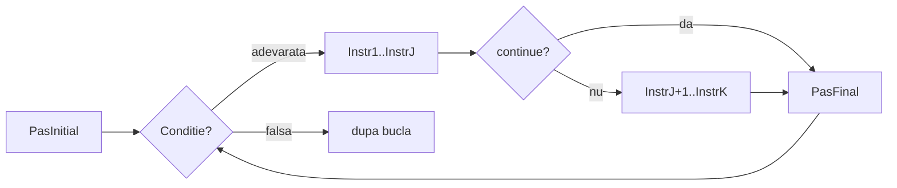

# Instructiunea continue

`continue` se foloseste in interiorul unei bucle pentru a **sari peste restul iteratiei curente** si a trece direct la urmatoarea. Spre deosebire de `break`, bucla nu se opreste — doar iteratia in curs e intrerupta.

## Sintaxa

```cpp
for (PasInitial; Conditie; PasFinal)
{
    Instr1;
    // ...
    if (conditieDeSarire)
        continue;
    // ...
    InstrK;
}
```



- `continue` sare **la PasFinal**, nu iese din bucla — `i++` se executa in continuare
- instructiunile de dupa `continue` (pana la `}`) **nu se executa** in acea iteratie
- in `while`, `continue` sare direct **la reevaluarea conditiei**
- functioneaza la fel in bucle imbricate, dar iese doar din iteratia buclei interioare (ex: daca am for in for, are efect doar in for-ul din interior)

---

## Exemple

### Afisarea numerelor impare din 1 la n

**Problema:** Citeste un numar `n`. Afiseaza toate numerele impare din intervalul `[1, n]`.

**Rationament:** Parcurgem numerele de la `1` la `n`. Daca `i` e par, nu avem ce afisa — sarim cu `continue`. Altfel, afisam `i`.

```cpp
#include <iostream>
using namespace std;

int n, i;

int main()
{
    cin >> n;
    for (i = 1; i <= n; i++)
    {
        if (i % 2 == 0)
            continue;
        cout << i << " ";
    }
    return 0;
}
```

**Rulare cu `n = 7`:**
```
7
1 3 5 7
```

**Evolutia variabilelor:**

| Iteratie | i | i % 2 == 0 | actiune | afisare |
|----------|---|------------|---------|---------|
| 1 | 1 | nu | afiseaza | 1 |
| 2 | 2 | **da** | **continue** | — |
| 3 | 3 | nu | afiseaza | 3 |
| 4 | 4 | **da** | **continue** | — |
| 5 | 5 | nu | afiseaza | 5 |
| 6 | 6 | **da** | **continue** | — |
| 7 | 7 | nu | afiseaza | 7 |

---

### Suma numerelor pozitive

**Problema:** Se dau `n` numere intregi. Calculeaza suma celor pozitive ( ignora-le pe celelalte).

**Rationament:** Citim cate un numar. Daca e negativ sau zero, nu contribuie la suma — il sarim cu `continue`. Altfel, il adaugam.

```cpp
#include <iostream>
using namespace std;

int n, nr, i, s;

int main()
{
    cin >> n;
    s = 0;
    for (i = 1; i <= n; i++)
    {
        cin >> nr;
        if (nr <= 0)
            continue;
        s += nr;
    }
    cout << s;
    return 0;
}
```

**Rulare cu `n = 5`, sirul `3 -1 4 -2 2`:**
```
5
3 -1 4 -2 2
9
```

**Evolutia variabilelor:**

| Iteratie | i | nr | nr <= 0 | s | actiune |
|----------|---|----|---------|---|---------|
| 1 | 1 | 3 | nu | 3 | s += 3 |
| 2 | 2 | -1 | **da** | 3 | **continue** |
| 3 | 3 | 4 | nu | 7 | s += 4 |
| 4 | 4 | -2 | **da** | 7 | **continue** |
| 5 | 5 | 2 | nu | 9 | s += 2 |

---

### Cifre pare ale unui numar

**Problema:** Citeste un numar natural `n`. Afiseaza cate cifre pare are.

**Rationament:** Extragem cifrele una cate una cu `% 10` si `/ 10`. Daca cifra e impara, o sarim cu `continue`. Altfel, incrementam contorul.

```cpp
#include <iostream>
using namespace std;

int n, cif, cnt;

int main()
{
    cin >> n;
    cnt = 0;
    while (n > 0)
    {
        cif = n % 10;
        n /= 10;
        if (cif % 2 != 0)
            continue;
        cnt++;
    }
    cout << cnt;
    return 0;
}
```

**Rulare cu `n = 1234`:**
```
1234
2
```

**Evolutia variabilelor:**

| Iteratie | n inainte | cif | n dupa | cif impar | actiune |
|----------|-----------|-----|--------|-----------|---------|
| 1 | 1234 | 4 | 123 | nu | cnt++ → 1 |
| 2 | 123 | 3 | 12 | **da** | **continue** |
| 3 | 12 | 2 | 1 | nu | cnt++ → 2 |
| 4 | 1 | 1 | 0 | **da** | **continue** |

> **Obs:** `n /= 10` se afla **inainte** de `continue`. Astfel, chiar daca sarim `cnt++`, `n` se micsoreaza la fiecare iteratie si bucla se termina. Daca `n /= 10` ar fi fost dupa `continue`, bucla ar fi infinita pentru cifrele impare.

---

## Capcane frecvente

### 1. `continue` in `while` — pasul de avansare dupa `continue`

In `for`, `continue` sare la PasFinal (`i++`), deci bucla avanseaza intotdeauna. In `while` nu exista PasFinal — `continue` sare direct la conditie, iar daca avansarea (`n /= 10`, `i++` etc.) e scrisa **dupa** `continue`, nu se va mai executa si bucla devine infinita.

```cpp
// GRESIT — n /= 10 e dupa continue; pentru cifre impare, n nu scade => bucla infinita
while (n > 0)
{
    cif = n % 10;
    if (cif % 2 != 0)
        continue;   // sare peste n /= 10 !!!
    cnt++;
    n /= 10;
}
```

```cpp
// CORECT — n /= 10 e inainte de continue; n scade intotdeauna
while (n > 0)
{
    cif = n % 10;
    n /= 10;
    if (cif % 2 != 0)
        continue;
    cnt++;
}
```

### 2. `continue` vs. `if`

De multe ori, acelasi efect se obtine cu un simplu `if`, mai usor de citit. Foloseste `continue` cand vrei sa eviti a pune mare parte din codul pe care il executi la o iteratie in acoladele unui if sau else.

Urmatoarele 2 exemple sunt echivalente:

```cpp
// Cu continue
for (i = 1; i <= n; i++)
{
    cin >> nr;
    if (nr <= 0)
    {
        continue; // ignor nr daca e negativ
    }
    s += nr;
    cnt++;
    cout << nr << " ";
}
```

```cpp
// Echivalent cu if — la fel de clar, alege ce ti se pare mai lizibil
for (i = 1; i <= n; i++)
{
    cin >> nr;
    if (nr > 0) // tratez nr doar daca e strict pozitiv
    {
        s += nr;
        cnt++;
        cout << nr << " ";
    }
}
```
