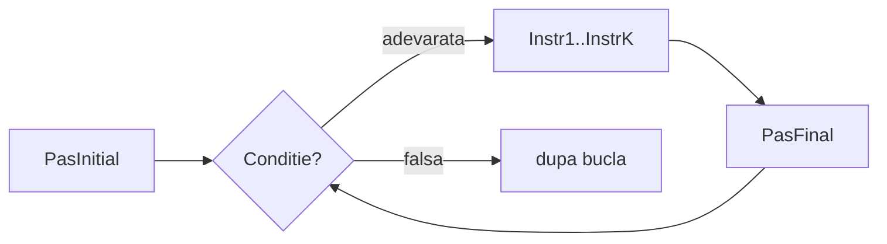

# Instructiunea for

`for` este o alternativa la `while` pentru situatii in care stim dinainte ce interval parcurgem sau de cate ori repetam. Initializarea, conditia si pasul stau intr-o singura linie.

## Sintaxa

```cpp
for (PasInitial; Conditie; PasFinal)
{
    Instr1;
    Instr2;
    // ...
    InstrK;
}
```



- **PasInitial** — o instructiune, executata o singura data, inainte de prima verificare a conditiei
- **Conditie** — expresie logica (adevarata sau falsa), verificata la inceputul fiecarei iteratii; cat timp e adevarata, bucla continua
- **PasFinal** — o instructiune, executata la sfarsitul fiecarei iteratii, inainte de re-evaluarea conditiei

---

## Echivalenta cu while

Orice `for` poate fi rescris ca `while`:

```cpp
PasInitial;
while (Conditie)
{
    Instr1; Instr2; ... InstrK;
    PasFinal;
}
```

`for` nu adauga putere noua — e doar o scriere mai compacta pentru un tipar frecvent.

---

## Tipare uzuale

### "Fac ceva de n ori" — de la 1 la n

Cel mai frecvent tipar: parcurgem numerele de la `1` la `n`.

```cpp
for (i = 1; i <= n; i++)
{
    // ...
}
```

PasInitial: `i = 1` &nbsp;|&nbsp; Conditie: `i <= n` &nbsp;|&nbsp; PasFinal: `i++`

### "Fac ceva pentru numerele de la a la b" — interval general

Cand intervalul nu incepe neaparat de la 1:

```cpp
for (i = a; i <= b; i++)
{
    // ...
}
```

PasInitial: `i = a` &nbsp;|&nbsp; Conditie: `i <= b` &nbsp;|&nbsp; PasFinal: `i++`

### Parcurgere descrescatoare

Cand vrem sa mergem de la `b` la `a` in sens invers:

```cpp
for (i = b; i >= a; i--)
{
    // ...
}
```

> **Obs:** Conditia se inverseaza (`>=` in loc de `<=`) si PasFinal devine `i--`.

### Pas diferit de 1

PasFinal poate fi orice instructiune — de exemplu, sa mergem din 3 in 3:

```cpp
for (i = 1; i <= n; i += 3)
{
    // ...
}
```

---

## Exemple

### Afisarea numerelor de la 1 la n

```cpp
#include <iostream>
using namespace std;

int n, i;

int main()
{
    cin >> n;
    for (i = 1; i <= n; i++)
    {
        cout << i << " ";
    }
    cout << endl;
    return 0;
}
```

**Rulare cu `n = 5`:**
```
5
1 2 3 4 5
```

**Evolutia lui `i` pentru `n = 5`:**

| Iteratie | i | i <= 5 | Afisare | i dupa PasFinal |
|----------|---|--------|---------|-----------------|
| 1 | 1 | adevarat | 1 | 2 |
| 2 | 2 | adevarat | 2 | 3 |
| 3 | 3 | adevarat | 3 | 4 |
| 4 | 4 | adevarat | 4 | 5 |
| 5 | 5 | adevarat | 5 | 6 |
| — | 6 | **fals** | — | — |

---

### Suma primelor n numere

```cpp
#include <iostream>
using namespace std;

int n, i, suma;

int main()
{
    cin >> n;
    suma = 0;
    for (i = 1; i <= n; i++)
    {
        suma = suma + i;
    }
    cout << suma << endl;
    return 0;
}
```

**Rulare cu `n = 5`:**
```
5
15
```

---

### Afisarea numerelor de la a la b

```cpp
#include <iostream>
using namespace std;

int a, b, i;

int main()
{
    cin >> a >> b;
    for (i = a; i <= b; i++)
    {
        cout << i << " ";
    }
    cout << endl;
    return 0;
}
```

**Rulare cu `a = 3`, `b = 7`:**
```
3 7
3 4 5 6 7
```

---

### Afisare descrescatoare de la n la 1

```cpp
#include <iostream>
using namespace std;

int n, i;

int main()
{
    cin >> n;
    for (i = n; i >= 1; i--)
    {
        cout << i << " ";
    }
    cout << endl;
    return 0;
}
```

**Rulare cu `n = 5`:**
```
5
5 4 3 2 1
```

---

### Afisarea multiplilor lui 3 din intervalul [1, n]

```cpp
#include <iostream>
using namespace std;

int n, i;

int main()
{
    cin >> n;
    for (i = 3; i <= n; i += 3)
    {
        cout << i << " ";
    }
    cout << endl;
    return 0;
}
```

**Rulare cu `n = 20`:**
```
20
3 6 9 12 15 18
```

> **Obs:** PasInitial e `i = 3` (primul multiplu de 3), PasFinal e `i += 3` (sarim direct la urmatorul multiplu).

---

## Capcane frecvente

### 1. Punct si virgula accidental dupa `for`

```cpp
// GRESIT — bucla goala; instructiunile de jos se executa o singura data, dupa bucla
for (i = 1; i <= n; i++);
{
    cout << i << " ";
}
```

```cpp
// CORECT
for (i = 1; i <= n; i++)
{
    cout << i << " ";
}
```

### 2. Modificarea variabilei de control in interiorul buclei

```cpp
// GRESIT — i e modificat atat de PasFinal (i++) cat si de codul din bucla
for (i = 1; i <= n; i++)
{
    cout << i << " ";
    i++;  // sare peste numere impare
}
```

Daca vrei un pas diferit de 1, schimba PasFinal — nu modifica `i` in corpul buclei.

---

## Mai multe variabile in PasInitial si PasFinal

PasInitial si PasFinal pot contine **mai multe instructiuni**, separate prin virgula `,`.

```cpp
for (PasInitial1, PasInitial2; Conditie; PasFinal1, PasFinal2)
{
    // ...
}
```

### Exemplu: afisarea perechilor egal departate de capete

**Problema:** Citeste un numar `n`. Afiseaza perechile `(st, dr)` unde `st` porneste de la `1` si `dr` de la `n`, pana cand se intalnesc.

```cpp
#include <iostream>
using namespace std;

int n, st, dr;

int main()
{
    cin >> n;
    for (st = 1, dr = n; st < dr; st++, dr--)
    {
        cout << st << " " << dr << endl;
    }
    cout << endl;
    return 0;
}
```

**Rulare cu `n = 6`:**
```
6
1 6 
2 5
3 4
```

**Evolutia variabilelor pentru `n = 6`:**

| Iteratie | st | dr | st < dr | Afisare |
|----------|----|----|---------|---------|
| 1 | 1 | 6 | adevarat | 1 6 |
| 2 | 2 | 5 | adevarat | 2 5 |
| 3 | 3 | 4 | adevarat | 3 4 |
| — | 4 | 3 | **fals** | — |

> **Obs:** La fiecare iteratie, `st++` si `dr--` se executa simultan (ambele fac parte din PasFinal). Bucla se opreste cand `st >= dr`, adica cand cele doua capete s-au intalnit sau s-au trecut.
