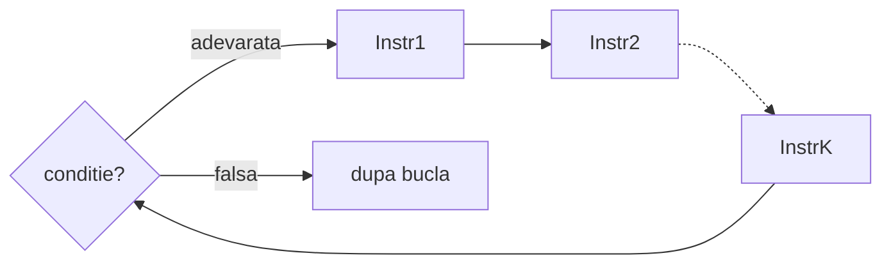

# Instructiunea while

Pana acum, cu `if`, un bloc de cod se executa **o singura data** daca o conditie e adevarata. Cu `while`, blocul se executa **repetat**, cat timp conditia ramane adevarata.

## Sintaxa

```cpp
while (conditie)
{
    Instr1; 
    Instr2;
    // ...
    InstrK;
}
```



iteratie = 1 singura executie a instructiunilor dintre `{` si `}`

> **Obs:** La fiecare iteratie, conditia se evalueaza din nou. De indata ce devine falsa, executia continua dupa `}`.


### Exemplu pas cu pas: Afisarea numerelor de la 3 la 7

```cpp
#include <iostream>
using namespace std;

int i;

int main()
{
    i = 3;
    while (i <= 7)
    {
        cout << i << " ";
        i++;
    }
    cout << "gata!" << endl;
    cout << "i este: " << i;
    return 0;
}
```

**Afisare:**
```
3 4 5 6 7 gata!
i este 8
```

**Evolutia variabilelor:**

| Iteratie | i | i <= 7 | 
|----------|---|--------|
| 1 | 3 | adevarat |
| 2 | 4 | adevarat |
| 3 | 5 | adevarat |
| 4 | 6 | adevarat |
| 5 | 7 | adevarat |
| — | 8 | **fals** |

> In acest exemplu s-au executat 5 iteratii (la inceputul fiecarei iteratii, i a avut valorile 3, 4, 5, 6, 7).
---

## De la "pana cand" la "cat timp"

Cand rezolvi o problema, e natural sa gandesti in termeni de **oprire**:

> "Fac X **pana cand** conditia de stop devine adevarata."

`while` insa lucreaza cu **continuare**:

> "Fac X **cat timp** conditia de continuare este adevarata."

Transformarea e simpla — **neghezi** conditia de oprire:

| Gandire naturala | Conditia de oprire | Conditia `while` |
|---|---|---|
| "pana cand `i > n`" | `i > n` | `while (i <= n)` |
| "pana cand `p > n`" | `p > n` | `while (p <= n)` |
| "pana cand `a > n`" | `a > n` | `while (a <= n)` |

### Exemplu introductiv: numerele de la 1 la n

**Rationament:** "Afiseaza `i`, pana cand `i` depaseste `n`."  
→ Conditia de oprire: `i > n` → Conditia `while`: `i <= n`

Inainte de bucla: initializam `i = 1`. In bucla: afisam `i`, apoi incrementam.

```cpp
#include <iostream>
using namespace std;

int n, i;

int main()
{
    cin >> n;
    i = 1;
    while (i <= n)
    {
        cout << i << " ";
        i++;
    }
    cout << endl;
    return 0;
}
```

**Rulare cu `n = 5`:**
```
5
1 2 3 4 5
```

> **Obs:** `i++` este esential — fara el, `i` ramane `1` si while-ul nu se opreste niciodata.

---

## Suma primelor n numere

**Problema:** Citeste un numar `n`. Calculeaza suma `1 + 2 + ... + n`.

**Rationament:** "Adauga `i` la suma, pana cand `i` depaseste `n`."  
→ Conditia `while`: `i <= n`

```cpp
#include <iostream>
using namespace std;

int n, i, suma;

int main()
{
    cin >> n;
    suma = 0;
    i = 1;
    while (i <= n)
    {
        suma = suma + i;
        i++;
    }
    cout << suma << endl;
    return 0;
}
```

**Rulare cu `n = 5`:**
```
5
15
```

---

## Puteri ale lui 2

**Problema:** Citeste un numar `n`. Afiseaza toate puterile lui 2 mai mici sau egale cu `n`.

**Rationament:** "Afiseaza `p`, pana cand `p` depaseste `n`."  
→ Conditia de oprire: `p > n` → Conditia `while`: `p <= n`

Inainte de while: `p = 1` (prima putere: 2⁰ = 1). In while: afisam `p`, apoi `p = p * 2`.

```cpp
#include <iostream>
using namespace std;

int n, p;

int main()
{
    cin >> n;
    p = 1;
    while (p <= n)
    {
        cout << p << " ";
        p = p * 2;
    }
    cout << endl;
    return 0;
}
```

**Rulare cu `n = 100`:**
```
100
1 2 4 8 16 32 64
```

**Evolutia lui `p` pentru `n = 100`:**

| Iteratie | p | p <= 100 | Afisare | p dupa executie |
|----------|---|----------|---------|-----------------|
| 1 | 1 | adevarat | 1 | 2 |
| 2 | 2 | adevarat | 2 | 4 |
| 3 | 4 | adevarat | 4 | 8 |
| 4 | 8 | adevarat | 8 | 16 |
| 5 | 16 | adevarat | 16 | 32 |
| 6 | 32 | adevarat | 32 | 64 |
| 7 | 64 | adevarat | 64 | 128 |
| — | 128 | **fals** | — | — |

---

## Sirul Fibonacci

**Problema:** Citeste un numar `n`. Afiseaza toti termenii sirului Fibonacci mai mici sau egali cu `n`.

Sirul Fibonacci: **1, 1, 2, 3, 5, 8, 13, 21, 34, ...**  
Fiecare termen e suma celor doi anteriori.

**Rationament:** "Afiseaza termenul curent `a`, pana cand `a` depaseste `n`."  
→ Conditia `while`: `a <= n`

Avem doua variabile consecutive: `a` (termenul afisat) si `b` (urmatorul). La fiecare pas:
1. Afisam `a`
2. Calculam urmatoarea pereche: `t = a + b`, `a = b`, `b = t`

```cpp
#include <iostream>
using namespace std;

int n, a, b, t;

int main()
{
    cin >> n;
    a = 1;
    b = 1;
    while (a <= n)
    {
        cout << a << " ";
        t = a + b;
        a = b;
        b = t;
    }
    cout << endl;
    return 0;
}
```

**Rulare cu `n = 20`:**
```
20
1 1 2 3 5 8 13
```

**Evolutia variabilelor pentru `n = 20`:**

| Iteratie | a | b | a <= 20 | Afisare | a dupa | b dupa |
|----------|---|---|---------|---------|--------|--------|
| 1 | 1 | 1 | adevarat | 1 | 1 | 2 |
| 2 | 1 | 2 | adevarat | 1 | 2 | 3 |
| 3 | 2 | 3 | adevarat | 2 | 3 | 5 |
| 4 | 3 | 5 | adevarat | 3 | 5 | 8 |
| 5 | 5 | 8 | adevarat | 5 | 8 | 13 |
| 6 | 8 | 13 | adevarat | 8 | 13 | 21 |
| 7 | 13 | 21 | adevarat | 13 | 21 | 34 |
| — | 21 | 34 | **fals** | — | — | — |

> **Obs:** Variabila temporara `t` e necesara deoarece la pasul `a = b` pierdem valoarea veche a lui `a`, care e necesara pentru `b = a + b`. `t` o salveaza inainte sa fie suprascris.

---

## Capcane frecvente

### 1. Bucla infinita (en. infinite loop)

Bucla infinita = o instructiune repetitiva pentru care conditia nu va fi NICIODATA falsa (de-a lungul executiei)

In exemplul de mai jos, elevul voia sa afiseze numerele de la 1 la n (unde n e un nr >= 1). 

Dar, a uitat sa mai creasca i-ul. Deci, conditia 1 <= n ramane mereu ADEVARATA.

```cpp
// GRESIT — i nu se modifica niciodata
i = 1;
while (i <= n)
{
    cout << i << " ";
}
```

```cpp
// CORECT
i = 1;
while (i <= n)
{
    cout << i << " ";
    i++;
}
```

### 2. Conditie falsa de la inceput

Daca conditia este falsa, inca de prima data cand este evaluata, 
atunci nu se va executa nicio iteratie.

```cpp
// Daca n = 0: conditia 1 <= 0 e falsa de la inceput
// Nu se afiseaza nimic
i = 1;
while (i <= n)
{
    cout << i << " ";
    i++;
}
```
