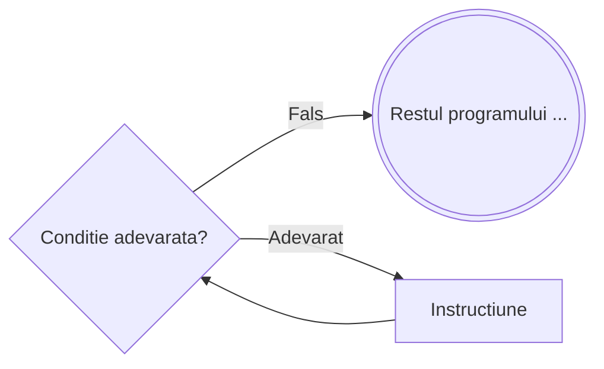

# Cat timp

```
┌ cat timp <conditie> executa
│    Instructiune
└■
```



---

**Mod de executie:**

1. Se evaluează `<conditie>`
2. Dacă este **adevărată**, se execută `Instructiune` și se revine la pasul 1
3. Dacă este **falsă**, se trece la următoarea instrucțiune

**Important:** Dacă condiția este de la început **falsă**, instrucțiunile **NU se vor executa** — testul are loc **la început**.

---

**Exemplu** – Suma cifrelor unui număr natural:

```
citeste n
S ← 0
┌ cat timp n ≠ 0 executa
│    S ← S + n % 10
│    n ← [n/10]
└■
scrie S
```

---

**Echivalența cu `while` din C/C++**

Instrucțiunea `cat timp ... executa` este echivalentă directă cu `while` din C/C++ — **condiția are același sens** în ambele variante, fără nicio inversare.

| Pseudocod | C/C++ |
|---|---|
| Se repetă **cât timp** condiția e **adevărată** | Se repetă **cât timp** condiția e **adevărată** |

```c
// C/C++
while (conditie) {
    InstructiuneCatTimp;
}
```

```
// Pseudocod echivalent
┌ cat timp <conditie> executa
│    InstructiuneCatTimp
└■
```

**Exemplu concret** – Suma cifrelor unui număr natural:

```
// Pseudocod
citeste n
S ← 0
┌ cat timp n ≠ 0 executa
│    S ← S + n % 10
│    n ← [n/10]
└■
scrie S
```

```c
// C/C++ echivalent
cin >> n;
int S = 0;
while (n != 0) {
    S += n % 10;
    n /= 10;
}
cout << S;
```