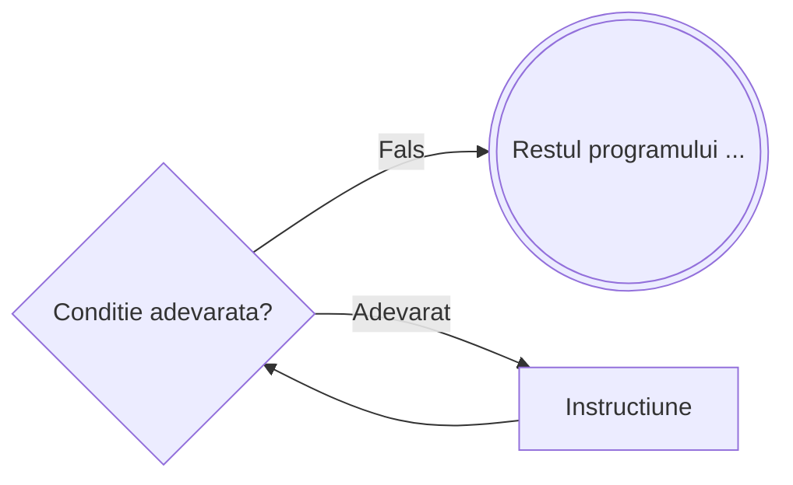

# Cat timp

```
┌ cat timp <conditie> executa
│    Instructiune
└■
```



---

**Mod de executie:**

1. Se evalueaza `<conditie>`
2. Daca este **adevarata**, se executa `Instructiune` si se revine la pasul 1
3. Daca este **falsa**, se trece la urmatoarea instructiune

**Important:** Daca conditia este de la inceput **falsa**, instructiunile **NU se vor executa** — testul are loc **la inceput**.

---

**Exemplu** – Suma cifrelor unui numar natural:

```
citeste n
S ← 0
┌ cat timp n ≠ 0 executa
│    S ← S + n % 10
│    n ← [n/10]
└■
scrie S
```

---

**Echivalenta cu `while` din C/C++**

Instructiunea `cat timp ... executa` este echivalenta directa cu `while` din C/C++ — **conditia are acelasi sens** in ambele variante, fara nicio inversare.

| Pseudocod | C/C++ |
|---|---|
| Se repeta **cat timp** conditia e **adevarata** | Se repeta **cat timp** conditia e **adevarata** |

```cpp
// C/C++
while (conditie) {
    InstructiuneCatTimp;
}
```

```
// Pseudocod echivalent
┌ cat timp <conditie> executa
│    InstructiuneCatTimp
└■
```

**Exemplu concret** – Suma cifrelor unui numar natural:

```
// Pseudocod
citeste n
S ← 0
┌ cat timp n ≠ 0 executa
│    S ← S + n % 10
│    n ← [n/10]
└■
scrie S
```

```cpp
// C/C++ echivalent
cin >> n;
int S = 0;
while (n != 0) {
    S += n % 10;
    n /= 10;
}
cout << S;
```
