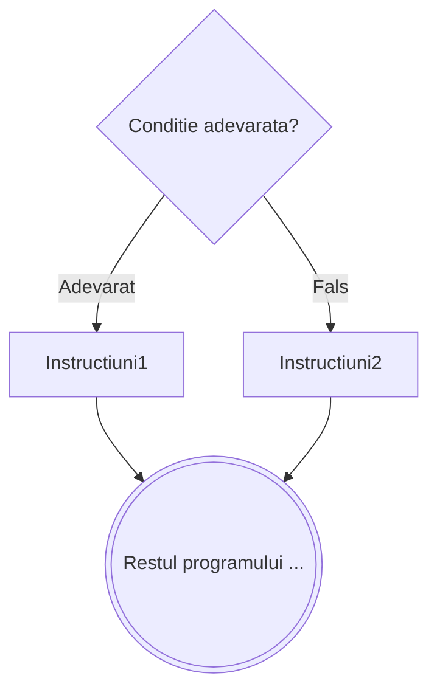

# Daca

```
┌ daca <conditie> atunci
│    Instructiuni1
│ altfel
│    Instructiuni2
└■
```



---

**Mod de executie:**

1. Se evalueaza `<conditie>`
2. Daca este **adevarata**, se executa `Instructiuni1`
3. Daca este **falsa**, se executa `Instructiuni2`
4. In ambele cazuri se continua cu restul programului

Ramura `altfel` este **optionala**. Daca lipseste si conditia e falsa, nu se executa nimic si se trece mai departe:

```
┌ daca <conditie> atunci
│    Instructiuni
└■
```

---

**Exemplu** – Maximul a doua numere:

```
citeste a, b
┌ daca a > b atunci
│    scrie a
│ altfel
│    scrie b
└■
```

---

**Echivalenta cu `if`/`else` din C/C++**

Instructiunea `daca ... atunci ... altfel` este echivalenta directa cu `if`/`else` din C/C++ —
**conditia are acelasi sens** in ambele variante, fara nicio inversare.

```cpp
// C/C++
if (conditie)
    Instructiuni1;
else
    Instructiuni2;
```

```
// Pseudocod echivalent
┌ daca <conditie> atunci
│    Instructiuni1
│ altfel
│    Instructiuni2
└■
```

**Exemplu concret** – Maximul a doua numere:

```
// Pseudocod
citeste a, b
┌ daca a > b atunci
│    scrie a
│ altfel
│    scrie b
└■
```

```cpp
// C/C++ echivalent
cin >> a >> b;
if (a > b)
    cout << a;
else
    cout << b;
```

> [!TIP] Conditii compuse
> Conditiile pot folosi operatorii logici `NOT`, `SI`, `SAU`. De exemplu, `daca a > 0 SI a < 10 atunci`
> verifica daca `a` este o cifra nenula. Vezi [Elemente de baza](/cpp/pseudocod/elemente-de-baza#operatori).
