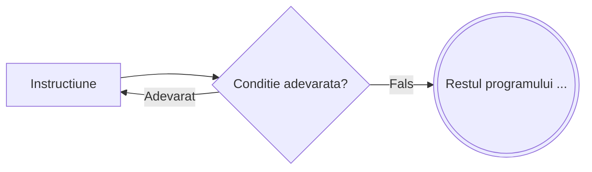

# Executa cat timp

```
┌ executa
│    Instructiune
└ cat timp <conditie>
```



---

**Mod de executie:**

1. Se executa `Instructiune`
2. Se evalueaza `<conditie>`
3. Daca este **adevarata**, se revine la pasul 1
4. Daca este **falsa**, se trece la urmatoarea instructiune

**Important:** Instructiunile se executa **cel putin o data**, indiferent de valoarea conditiei —
testarea conditiei are loc **la final**.

---

**Exemplu** – Numarul cifrelor unui numar natural:

```
citeste n
cnt ← 0
┌ executa
│    cnt ← cnt + 1
│    n ← [n/10]
└ cat timp n ≠ 0
scrie cnt
```

---

**Echivalenta cu `do...while` din C/C++**

Instructiunea `executa ... cat timp` este echivalenta directa cu `do...while` din C/C++ —
**conditia are acelasi sens** in ambele variante, fara nicio inversare.

| Pseudocod | C/C++ |
|---|---|
| Se repeta **cat timp** conditia e **adevarata** | Se repeta **cat timp** conditia e **adevarata** |

```cpp
// C/C++
do {
    Instructiune;
} while (conditie);
```

```
// Pseudocod echivalent
┌ executa
│    Instructiune
└ cat timp <conditie>
```

> [!IMPORTANT] `executa cat timp` vs `repeta pana cand`
> Ambele testeaza conditia **la final** si executa corpul minim o data, dar sensul conditiei este **opus**:
> - `executa ... cat timp` continua **cat timp** conditia e **adevarata** (la fel ca `do...while`).
> - [`repeta ... pana cand`](/cpp/pseudocod/repeta-pana-cand) se opreste **cand** conditia devine **adevarata**.
>
> Deci `executa cat timp n ≠ 0` si `repeta ... pana cand n = 0` fac acelasi lucru — conditiile sunt una opusul celeilalte.

**Exemplu concret** – Numarul cifrelor unui numar natural:

```
// Pseudocod
citeste n
cnt ← 0
┌ executa
│    cnt ← cnt + 1
│    n ← [n/10]
└ cat timp n ≠ 0
scrie cnt
```

```cpp
// C/C++ echivalent
cin >> n;
int cnt = 0;
do {
    cnt++;
    n /= 10;
} while (n != 0);
cout << cnt;
```
