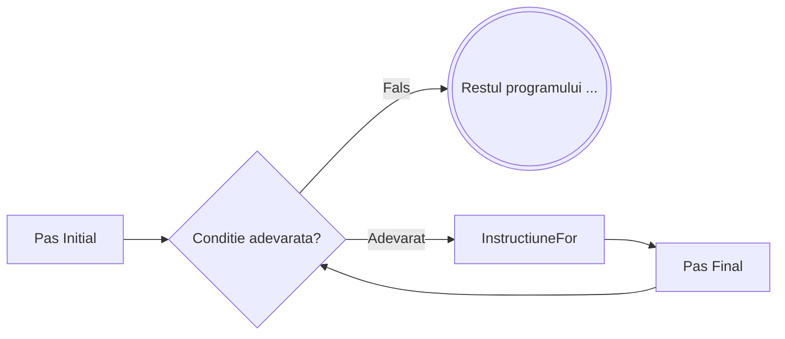

#

```c
for (PasInitial; Conditie; PasUrmator)
{
    InstructiuneFor;
}
```


```mermaid
graph LR

PI[Pas Initial] --> C{Conditie adevarata?}
C --> |Fals| RP(((Restul programului ...)))
C --> |Adevarat| Instr[InstructiuneFor]
Instr --> PF[Pas Final]
PF --> C


```