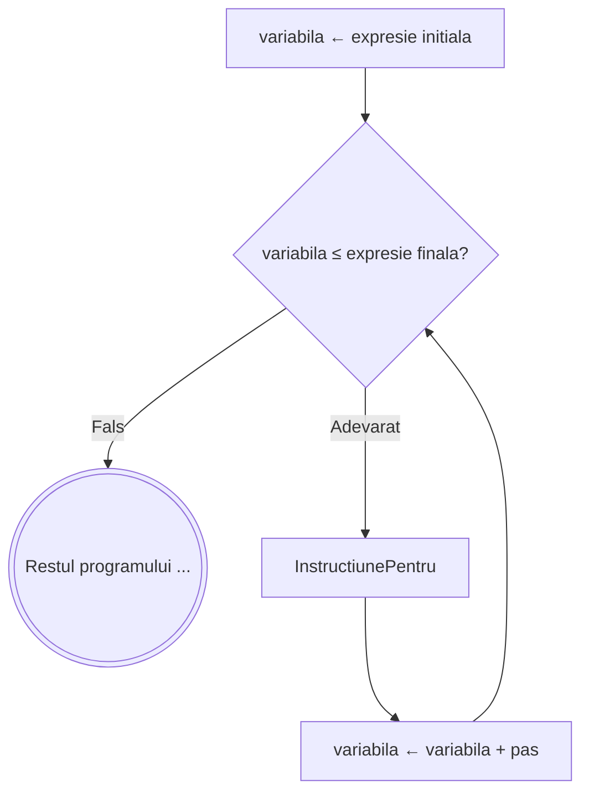

# Pentru

## Sintaxa
```
┌ pentru <variabila> ← <expresie initiala>, <expresie finala>, <pas> executa
│    InstructiunePentru
└■
```

## Exemplu 

### Suma numerelor naturale impare mai mici sau egale cu n:

```
citeste n
S ← 0
┌ pentru i ← 1, n, 2 executa
│    S ← S + i
└■
scrie S
```

### Schema logica


---

## Observatii

### Dacă `pas` **nu este menționat**, se consideră implicit valoarea `1`, deci variabila crește cu 1 la fiecare iterație (for crescător).

### **Exemplu cand pasul este omis**

### Se calculeaza produsul numerelor de la 5 la 10
```
P ← 1
┌ pentru i ← 5, 10 executa
│    P ← P * i 
└■
```

### Dacă `pas` este **negativ** (de exemplu `-1`), variabila **scade** la fiecare iterație, rezultând un **for descrescător**. În acest caz, condiția de continuare devine `variabila ≥ expresie finala`, iar bucla se termină când variabila coboară sub valoarea finală.

### **Exemplu pas negativ** – Afișarea numerelor de la `9` la `4`:

> Programul va afisa 9 8 7 6 5 4

```
┌ pentru i ← 9, 4, -1 executa
│    scrie i, ' '
└■
```