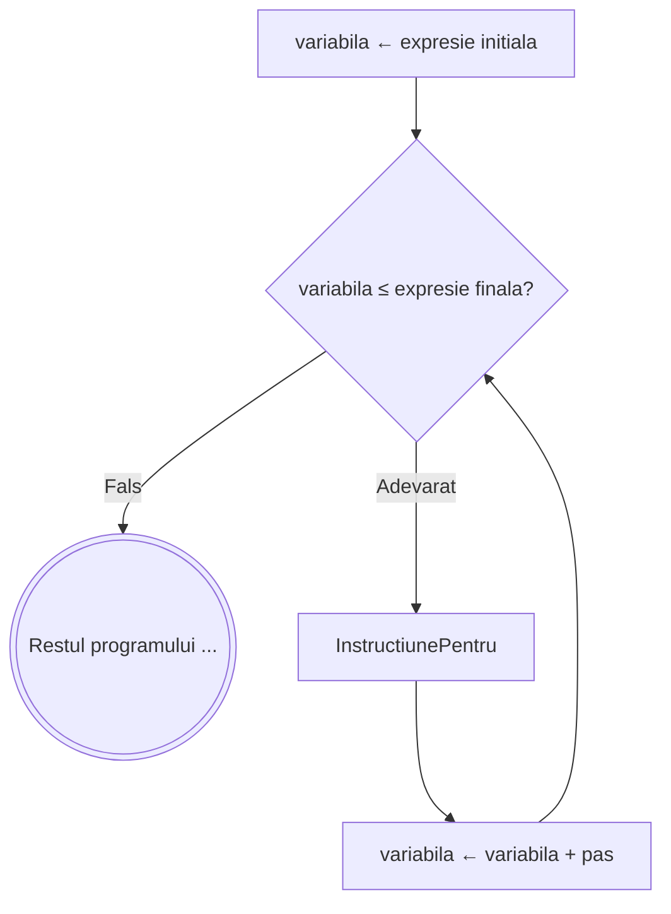

# Pentru

## Sintaxa
```
┌ pentru <variabila> ← <expresie initiala>, <expresie finala>, <pas> executa
│    InstructiunePentru
└■
```

## Exemplu

### Suma numerelor naturale impare mai mici sau egale cu n:

```
citeste n
S ← 0
┌ pentru i ← 1, n, 2 executa
│    S ← S + i
└■
scrie S
```

### Schema logica

```mermaid
graph TD

A[variabila ← expresie initiala]
A --> C{variabila ≤ expresie finala?}
C --> |Fals| RP(((Restul programului ...)))
C --> |Adevarat| Instr[InstructiunePentru]
Instr --> PF[variabila ← variabila + pas]
PF --> C
```

---

## Observatii

### Pasul implicit

Daca `pas` **nu este mentionat**, se considera implicit valoarea `1`, deci variabila creste cu 1 la
fiecare iteratie (for crescator).

**Exemplu** – Produsul numerelor de la 5 la 10:

```
P ← 1
┌ pentru i ← 5, 10 executa
│    P ← P * i
└■
```

### Pasul negativ

Daca `pas` este **negativ** (de exemplu `-1`), variabila **scade** la fiecare iteratie, rezultand un
**for descrescator**. In acest caz, conditia de continuare devine `variabila ≥ expresie finala`, iar bucla
se termina cand variabila coboara sub valoarea finala.

**Exemplu** – Afisarea numerelor de la `9` la `4`:

> Programul va afisa 9 8 7 6 5 4

```
┌ pentru i ← 9, 4, -1 executa
│    scrie i, ' '
└■
```
