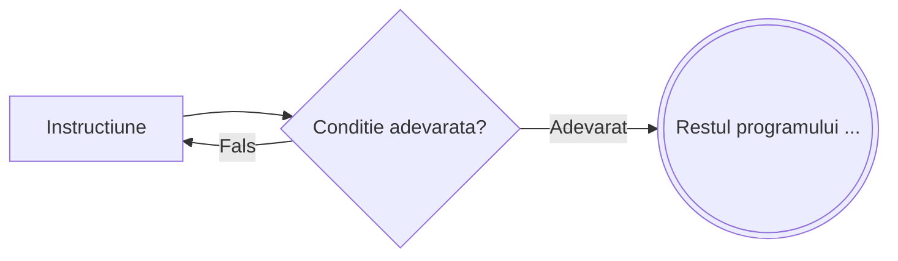

# Repeta pana cand

```
┌ repeta
│    Instructiune
└ pana cand <conditie>
```



---

**Mod de executie:**

1. Se execută `Instructiune`
2. Se evaluează `Conditia`
3. Dacă este **falsă**, se revine la pasul 1
4. Dacă este **adevărată**, se trece la următoarea instrucțiune

**Important:** Instrucțiunile se execută **cel puțin o dată**, indiferent de valoarea condiției — testarea conditiei are loc **la final**.

---

**Exemplu** – Calculeaza suma cifrelor lui n:

```
s ← 0
┌ repeta
│    s ← s + n % 10
└ pana cand n = 0
```

---

**Echivalența cu `do...while` din C/C++**

Instrucțiunea `repeta ... pana cand` este echivalentă cu `do...while` din C/C++, cu o singură diferență importantă: **sensul condiției este inversat**.

| Pseudocod | C/C++ |
|---|---|
| Se repetă **până când** condiția e **adevărată** | Se repetă **cât timp** condiția e **adevărată** |

Prin urmare, condiția din `pana cand` corespunde **negației** condiției din `do...while`:

```c
// C/C++
do {
    Instructiune;
} while (!conditie);
```

```
// Pseudocod echivalent
┌ repeta
│    Instructiune
└ pana cand <conditie>
```

**Exemplu concret** – Numărul cifrelor unui număr natural:

```
// Pseudocod
citeste n
cnt ← 0
┌ repeta
│    cnt ← cnt + 1
│    n ← [n/10]
└ pana cand n = 0
scrie cnt
```

```c
// C/C++ echivalent
cin >> n;
int cnt = 0;
do {
    cnt++;
    n /= 10;
} while (n != 0);
cout << cnt;
```