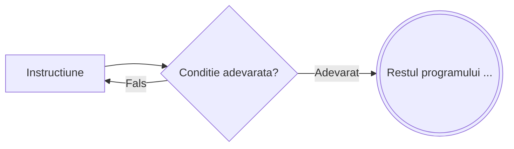

# Repeta pana cand

```
┌ repeta
│    Instructiune
└ pana cand <conditie>
```



---

**Mod de executie:**

1. Se executa `Instructiune`
2. Se evalueaza `Conditia`
3. Daca este **falsa**, se revine la pasul 1
4. Daca este **adevarata**, se trece la urmatoarea instructiune

**Important:** Instructiunile se executa **cel putin o data**, indiferent de valoarea conditiei — testarea conditiei are loc **la final**.

---

**Exemplu** – Calculeaza suma cifrelor lui n:

```
s ← 0
┌ repeta
│    s ← s + n % 10
│    n ← [n/10]
└ pana cand n = 0
```

---

**Echivalenta cu `do...while` din C/C++**

Instructiunea `repeta ... pana cand` este echivalenta cu `do...while` din C/C++, cu o singura diferenta importanta: **sensul conditiei este inversat**.

| Pseudocod | C/C++ |
|---|---|
| Se repeta **pana cand** conditia e **adevarata** | Se repeta **cat timp** conditia e **adevarata** |

Prin urmare, conditia din `pana cand` corespunde **negatiei** conditiei din `do...while`:

```cpp
// C/C++
do {
    Instructiune;
} while (!conditie);
```

```
// Pseudocod echivalent
┌ repeta
│    Instructiune
└ pana cand <conditie>
```

> [!TIP] Varianta cu acelasi sens
> Daca vrei o bucla cu test la final dar **fara** inversarea conditiei, exista
> [`executa ... cat timp`](/cpp/pseudocod/executa-cat-timp), care corespunde direct lui `do...while`.

**Exemplu concret** – Numarul cifrelor unui numar natural:

```
// Pseudocod
citeste n
cnt ← 0
┌ repeta
│    cnt ← cnt + 1
│    n ← [n/10]
└ pana cand n = 0
scrie cnt
```

```cpp
// C/C++ echivalent
cin >> n;
int cnt = 0;
do {
    cnt++;
    n /= 10;
} while (n != 0);
cout << cnt;
```
